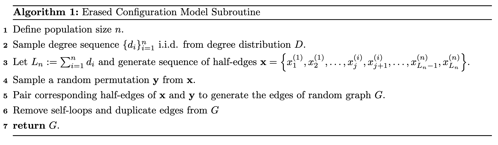
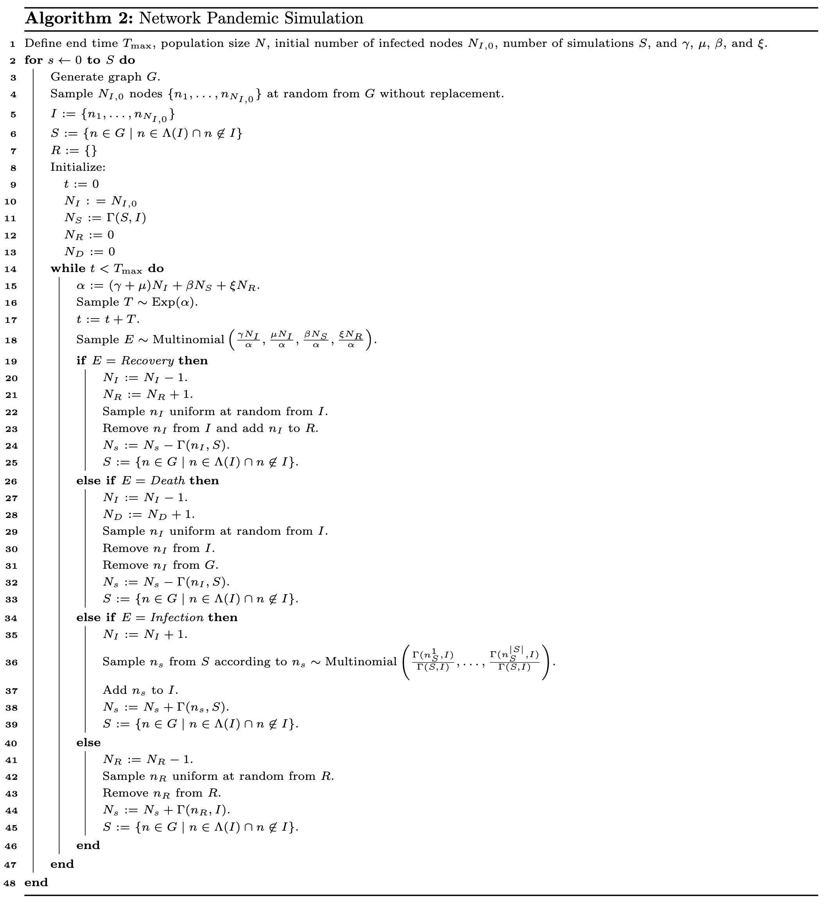
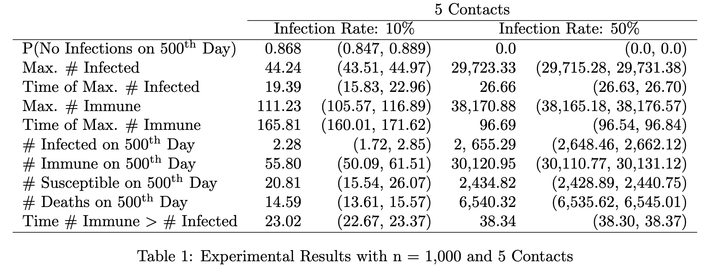
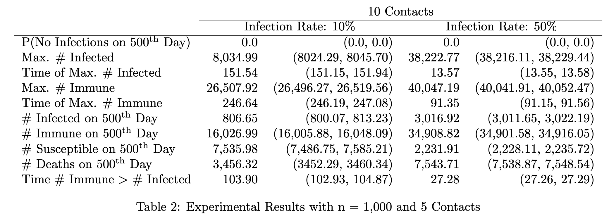
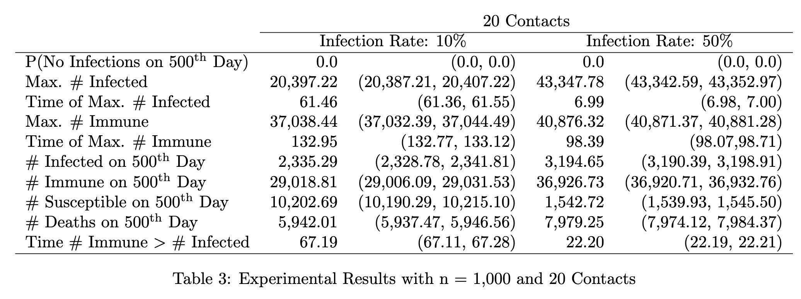
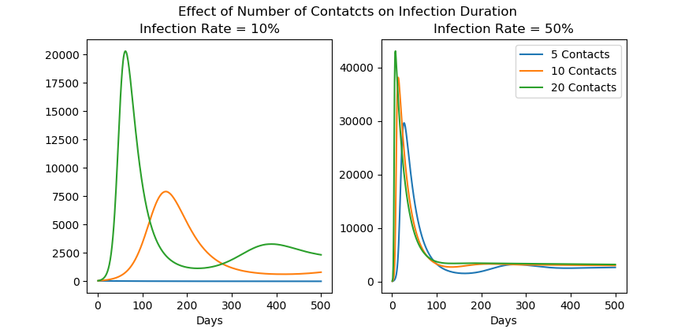

## Background

As COVID-19 continues to spread, understanding the dynamics of transmision remains a critically important question, and one that is well suited for study by simulation. Compartmental models (@KM) provide an established approach for studying the spread of infectious diseases. The key idea in this class of models is to break the population up into discrete compartments, e.g. susceptible, infected, and recovered individuals in the case of epidemiology, and model the movement of individuals between compartments. One relatively simple example is the Susceptible-Infected-Recovered-Susceptible (SIRS) model, which assumes immunity after infection and recovery is not permanent (the apparent case with COVID-19). 

## Model

### SIRS Model

Let $S$, $I$, and $R$ be the sizes of the susceptible, infected, and recovered populations respectively. Then the total population is given by $N = S +I + R$. Furthermore, let $\beta$ be the infection rate, i.e. the probability that an infected agent transfers the disease to a susceptible agent in a period, let $\gamma$ be the rate of recovery, and let $\xi$ be the rate at which agents lose immunity. Then we can characterize the evolution of the infection over time $t$ with the following system of differential equations, 
\begin{align}
    \frac{dS}{dt} &= -\frac{\beta SI}{N} + \xi R, \tag{1}\\
    \frac{dI}{dt} &= \frac{\beta SI}{N} - \gamma I, \tag{2}\\
    \frac{dR}{dt} &= \gamma I - \xi R. \tag{3}
\end{align}
We can characterize the steady state of this system by setting each equation to zero, and if we let $p\equiv I/N$ be the disease prevalence, then dividing each equation in the above expression by $N$ gives
\begin{align}
    \frac{dS/N}{dt} &= -\frac{S}{N}\beta p + \xi \frac{R}{N} =0, \tag{4}\\
    \frac{dp}{dt} &= \frac{ S}{N}\beta p - \gamma p = 0, \tag{5}\\
    \frac{dR/N}{dt} &= \gamma p - \xi \frac{R}{N} = 0. \tag{6}
\end{align}
The last equation implies that in the steady state(s), 
\begin{align}
    \frac{R}{N} = p\frac{\gamma}{\xi}.\tag{7}
\end{align} Furthermore, because we have assumed a fixed population $N = S + I + R$, then dividing by $N$ we have 
\begin{align}
    \frac{S}{N} = 1 - p - \frac{R}{N} \tag{8}
\end{align}
Substituting (7) into (8) and (8) into (5), we get that $\frac{d p }{dt}=0$ when
\begin{align}
    p = 
    \begin{cases}
    0,  & \text{if } \frac{\beta}{\gamma} < 1 \\
    \max\left\{\frac{\xi(\beta - \gamma)}{\beta(\xi + \gamma)}, 1\right\}, & \text{if } \frac{\beta}{\gamma} > 1.
    \end{cases} \tag{9}
\end{align}
For the second equilibrium to exist, we need $\beta - \gamma > 0$, which is where the basic reproduction number $R_0 = \beta / \gamma$ comes from. So the system admits two steady states, 
\begin{align}
    (S^*, I^*, R^*) = 
    \begin{cases}
    (N, 0, 0) \\
    \left(\frac{\gamma}{\beta}, \frac{N - \frac{\gamma}{\beta}}{1 + \frac{\gamma}{\xi}}, \frac{N - \frac{\gamma}{\beta}}{1 + \frac{\xi}{\gamma}}\right).
    \end{cases}\tag{10}
\end{align}
The disadvantage of the SIRS model is that it assumes homogeneous mixing among the agents. In other words, at each time step, an infected agent can interact with any other agent in the population and, given that they are susceptible, infect them with probability $\beta$. If we were to represent the system of interactions as a graph, it would be fully connected. This of course does not reflect how individuals actually interact, and presents a real drawback for studying the effects of an intervention like social distancing, which alters how agents interact and has become the primary policy response to COVID-19. My goal in this post is to improve upon the SIRS model by adding structure to the interactions of individuals via random graphs in a continuous time simulation of a pandemic. 

### Graph Structure

In order to impose some level of structure on social interactions, we can first generate a random graph using the Erased Configuration model described in the following subroutine:

For simplicity, we will generate $\{d_i\}_{i=1}^n \overset{i.i.d.}{\sim}\text{Poisson}(\nu)$, where $\nu$ represents the average number of contacts (edges) each individual (node) has. The following function implements Algorithm 1 in python.

```{python, eval=FALSE}
import numpy as np
import networkx as nx
import random
import matplotlib.pyplot as plt

def configGraph(avg_degree, n, model='poisson'):
	"""
	Generates a random graph according to the configuration model
	without any self loops and no duplicate edeges.

	Parameters:
		avg_degree (int): The average degree of the nodes.
		n (int): Number of nodes.
		model (str): Model for generating degree sequence.

	Returns:
		G (Graph)
	"""
	if model == 'poisson':
		degree_seq = np.random.poisson(lam=avg_degree, size=n)
	
	ledge = np.repeat(np.arange(n), degree_seq)
	redge = np.random.permutation(ledge)
	edges = [(l,r) for l, r in zip(ledge, redge) if l != r]
	G = nx.Graph()
	G.add_edges_from(edges)
	return G
```


### SIRS with Deaths on Graph

In addition to specifying a graph structure for inhomogeneous interactions, we deviate from the typical SIRS framework by allowing our agents to perish from the infection, and subsequently be removed from $G$. Therefore, the possible events in the system we are simulating include:  

* An infected node recovers and gains immunity.  
* A recovered node loses immunity and becomes susceptible.  
* A susceptible node is infected by an infected neighbor.  
* An infected node dies and is removed from $G$.  

To simulate the spread of a pandemic through a network, we assume the occurrence of each event follows an exponential distribution,  

* Given that a node $n_I$ is infected, the duration of the infection for $n_I$ is an exponential random variable with mean $1/\gamma$ days.  
* Given that a node $n_I$ is infected, the time at which $n_I$ dies is an exponential random variable with mean $1/\mu$ days.  
* Given that a node $n_S$ is susceptible and has an infected neighbor, the time until that neighbor infects $n_S$ is an exponential random variable with mean $1/\beta$ days.  
* Given that a node $n_R$ is immune, the time until $n_R$ loses immunity is an exponential random variable with mean $1/\xi$ days.  

Suppose that $n_I$ is an infected node and let $R \sim \text{Exp}(\gamma)$ be the time until $n_I$ recovers and $D \sim\text{Exp}(\mu)$ be the time until $n_I$ dies, then the probability that $n_I$ dies before recovering is given by 
\begin{align*}
    P(D < R) &= \int_0^\infty P(D < R, R = r) \;dr \\
    &= \int_0^\infty P(D < R \;|\; R = r)f_R(r) \;dr \\
    &= \int_0^\infty P(D < r)f_R(r) \;dr \\
    &= \int_0^\infty [1 - \exp(-\mu r)]\gamma\exp(-\gamma r) \;dr \\
    &= \lim_{r\to\infty}\left[\frac{\gamma}{\gamma + \mu}\exp[-r(\gamma+\mu)] - \exp(-\gamma r)\right]_0^r \\
    &= \frac{\mu}{\mu + \gamma}.
\end{align*}

## Simulation Study

For modeling COVID-19, we know it takes approximately 25 days on average to fully recover ($\gamma = 1/25$, @ling2020persistence), and we know that the mortality rate is approximately 7\%, so we can back-out $\mu$ as $$0.07 = \frac{\mu}{\mu + \frac{1}{25}} \implies \mu = 0.003.$$ We can use a similar procedure to back-out $\beta$ once we specify a probability that a susceptible node is infected by an infected neighbor. For $\xi$ we will simply make an assumption about the duration of immunity. 

Suppose now that we just have one node and want to determine the time of the next event $E = \min\{D, R\}$, then another convenient property of assuming exponential events is that $T \sim \text{Exp}(\gamma + \mu)$ and because the type of event $E$ only has support on $\{\text{Recovery}, \text{Death}\} = \left\{\text{Recovery}, \text{Recovery}^C\right\}$, and 
\begin{gather*}
    P(E = \text{Death}) = P(D < R) = \frac{\mu}{\mu + \gamma} \\ 
    \implies \\
    P(E = \text{Recovery}) = P\left(E = \text{Death}^C\right) = 1 - \frac{\mu}{\mu + \gamma} = \frac{\gamma}{\mu + \gamma}.
\end{gather*}
So $E$ is a Bernoulli random variable with success probability $\mu/(\mu + \gamma)$, and we can simulate the next event by drawing a time $T$ and a type of event $E$. This argument generalizes to the case of many independent exponential random variables. If $T_i \sim \text{Exp}(\lambda_i)$ for all $i \in \{1, \ldots, n\}$ and the $T_i$'s are jointly independent, then, $$T = \min\{T_i, \ldots, T_n\} \sim \text{Exp}\left(\sum_{i=1}^n \lambda_i\right),$$ and the index of the event $i$ follows a multinomial distribution where $$P(i = j) = \frac{\lambda_j}{\sum_{i=1}^n \lambda_i}.$$ 

Algorithm 2 gives the full details of our simulation. For notational convenience let $\Lambda(n)$ be the set of neighbors of the node(s) $n$ and let $\Gamma(n_i, n_j)$ be the count of edges between node(s) $n_i$ and $n_j$.

A single replicate of the simulation is implemented in python at the end of this post.

## Results

Tables 1-3 below display experimental results from 1,000 simulations with 95\% confidence intervals for the following parameter values:  

* Population size: 50,000.  
* Initially infected nodes: 50 (0.1\% of the population).  
* $\gamma = 1/25$ -- Average disease duration of 25 days.[^1]  
* $\xi = 1/270$ -- Immunity lasts for an average of 270 days.[^2]

In addition to the parameters specified above, we experiment with two different values of $\beta$ corresponding to infection rates of 10\% and 50\% respectively. We also experiment with three configurations of the Poisson degree distribution with $\lambda \in \{5, 10, 20\}$ corresponding to strong, mild, and no social distancing scenarios.[^3]







In order to generate the plots in Figures 1 and 2, the simulations are discretized by taking the average of each counter over each day (if there is no change the the counter takes the same value as the previous day's average). The plots are the the averages of each daily average across the 1,000 simulations, with the shaded regions representing 95\% confidence intervals (in most cases these are too tight to actually visualize).




The most notable feature of these results is that social distancing is very effective at reducing the spread of infection. In Table 1 we see that the model configuration with an average five contacts and a 10\% infection rate results in a large positive probability (0.868) that the infection ends in the first 500 days. This is reflected in Figure1, where we see the infection failing to take hold for this parameterization so that the number of infections decreases towards zero from the very start. Figures 1 and 2 also clearly display the "flattening of the curve" phenomenon that social distancing is meant to accomplish (this is also reflected in Tables 1-3, where decreasing the number of contacts pushes out the time that the number of infections reaches its peak and lowers that peak). Despite this, the number of infected agents on the 500\textsuperscript{th} day is decreasing in the average number of contacts, regardless of the infection rate. Looking at the results in Tables 1-3 we see that social distancing also has the effect decreasing the number of agents that have died by the 500\textsuperscript{th} day, regardless of the infection rate. 

One surprising result from the 50\% infection rate case is that even though decreasing the number of contacts decreases the maximum number infected (29,723, 38,223, and 43,348 in the five, ten, and twenty contact cases respectively), and pushes out the time of the infection peak (27, 14, and 7 days respectively), it has much less of a pronounced effect on the maximum number of agents gaining immunity (38,171, 40,047, and 40,876 respectively). 

The other interesting behavior we can see emerging is the occurrence of resurgences, e.g. in the five contact, 50\% infection rate and twenty contact, 10\% infection rate cases. The fact that there is recurrence in the no social distancing case is especially interesting, as it tells us that even though the pandemic peaks earlier, the drop in infections after the peak is not sharp enough to stop the infection from spreading further, which contradicts the logic of trying to achieve herd immunity as quickly as possible by refusing to adopt social distancing (e.g. the policy pursued by Sweden and the UK with COVID-19). 

## Python Implementation of Algorithm 2 

The full code for implementing the simulation is available in this [github repo](https://github.com/davis-berlind/infection-simulator). The main routine is `infection_simulation.py` which I ran in parallel using a Slurm Workload Manager and the following bash script.

```{bash, eval=FALSE}
#!/bin/bash
#SBATCH --mem-per-cpu=2G
#SBATCH --job-name=sim
#SBATCH -c 1
#SBATCH -a 1-1000

contacts=20
infection_rate=0.1

python3 infection_simulation.py $contacts $infection_rate
```

Here is the python code for a single simulation replicate. 

```{python, eval=FALSE}
import sys, os, random
import numpy as np
import pandas as pd
import networkx as nx

#### simulation functions ####

def days_to(prob, infection_length):
	"""
	Calculate mean number of days to event given 
	P(event occurs before infection ends).

	Parameters:
		prob (float): P(event occurs before infection ends).
		infection_length (float): Average duration of infection in days.

	Returns:
		days (float): Average days to event corresponding to 
		P(event occurs before infection ends) and average duration 
		of infection.
	"""
	days = infection_length*(1 - prob) / prob
	return days
	
def get_susceptible_neighbors(node, infected, recovered, G):
	"""
	Finds the neighbors of a node in graph G that are neither infected 
	nor immune.

	Parameters: 
		node (int): Name of node whose neighbors we want to check.
		infected (list): List of the names of infected nodes.
		recovered (list): List of the names of immune nodes.
		G (Graph)

	Returns:
		neighbors (list): Node's neighbors that are neither infected nor immune.
	"""
	neighbors = [k for k in G[node].keys() if k not in infected and k not in recovered]
	return neighbors

def get_susceptible(infected, recovered, G):
	"""
	Finds all nodes in graph G that neighbor an infected node and are neither
	infected nor immune.

	Parameters: 
		infected (list): List of the names of infected nodes.
		recovered (list): List of the names of immune nodes.
		G (Graph)

	Returns:
		susceptible (list): List of nodes neighboring an infected node
		that are neither infected nor immune.
	"""
	susceptible = []
	for node in infected:
		neighbors = get_susceptible_neighbors(node, infected, recovered, G)
		susceptible.extend(neighbors)
	return susceptible

def simulation(G, T, init_pct_infected, lambda_recovered, lambda_susceptible, lambda_death, lambda_infected, 
			   return_event_list=False, finish=True):
	"""
	Simulates infection on graph G

	Parameters:
		G (Graph)
		T (float): Maximum simulation days.
		init_pct_infected (float): Initial percent of the population that is infected.
		lambda_recovered (float): Days to Revovery | Infected ~ Exp(lambda_recovered).
		lambda_susceptible (float): Days to No Longer Immune | Immune ~ Exp(lambda_susceptible).
		lambda_death (float): Days to Death | Infected ~ Exp(lambda_death).
		lambda_infected (float): Days to Infected | Neighbor Infected ~ Exp(lambda_infected).
		return_event_list (bool): Return complete event list if True.
		finish (bool): Whether to keep simulating after infection ends.

	Returns:
		stats (list): Simulation statistics including time simulation ends, # infected at end, 
		# immune at end, # susceptible at end, # deaths at end, time # immune first intersects # infected,
		maximumn # infected, time of maximumn # infected, maximumn # immune, time of maximumn # immune.

		event_list (list): Complete event list.
	"""
	t = 0
	nodes = [node for node in G.nodes] 

	## initializing parameters and counters ##
	n_infected = int(init_pct_infected * len(nodes)) 	  # intial number of infected nodes
	infected = random.sample(nodes, k=n_infected)    	  # initial infected nodes
	recovered = []                                   	  # initial nodes with immunity
	n_recovered = 0                                  	  # initial number of recovered nodes
	susceptible = get_susceptible(infected, recovered, G) # initial nodes with infected neighbors
	n_susceptible = len(set(susceptible))                 # initial number of nodes with infected neighbors
	e_susceptible = len(susceptible)                      # initial number of edges from susceptible to infected nodes
	n_deaths = 0                                          # initial number of deaths
	t_intersect = None									  # time that # immune first excedes # infected
	ri_intersect = False                                  # tracker for if # immune has exceded # infected
	max_infected = n_infected						      # maximum number of infected nodes during simulation
	max_recovered = n_recovered						      # maximum number of immune nodes during simulation
	t_max_infected = 0
	t_max_recovered = 0

	event_list = [[t, n_infected, n_recovered, n_susceptible, n_deaths]]

	while t < T:
		# calulate probability of next event
		p_vals = [n_infected*lambda_recovered, n_infected*lambda_death, e_susceptible*lambda_infected, n_recovered*lambda_susceptible]
		lambda_all = n_infected*(lambda_recovered + lambda_death) + e_susceptible*lambda_infected + n_recovered*lambda_susceptible

		# sample time of next event
		t += np.random.exponential(1 / lambda_all)

		# sample type of next event
		event = np.random.multinomial(n=1, pvals=[p / lambda_all for p in p_vals])

		# next event is a recovery
		if event[0] == 1:
			random.shuffle(infected)                       					  # shuffle to randomly select recovered node
			recoverer = infected.pop()                     					  # sample recovering node
			for rm in G[recoverer].keys():                 					  # removing suscepitble neighbors of recovered node
				if rm in susceptible:
					susceptible.remove(rm)      
			recovered.append(recoverer)                    					  # move infected node to recovered
			 
		# next event is a death 
		if event[1] == 1:
			random.shuffle(infected)                       					  # shuffle to randomly select dead node
			dead = infected.pop()                          					  # sample dying node
			for rm in G[dead].keys():                    					  # removing suscepitble neighbors of dying node
				if rm in susceptible:
					susceptible.remove(rm)      
			G.remove_node(dead)                            					  # remove dying node from graph
			n_deaths += 1
			
		# next event is an infection 
		if event[2] == 1:
			random.shuffle(susceptible)                                       # shuffle to randomly select infected node
			sick = susceptible.pop()                                          # sample newly infected node
			susceptible = [s for s in susceptible if s != sick]               # delete duplicates of susceptible node 
			new_sus = get_susceptible_neighbors(sick, infected, recovered, G) # get newly susceptible nodes
			susceptible.extend(new_sus)                                       # add newly susceptible nodes
			infected.append(sick)                                             # add sampled node to infected nodes
				
		# next event is a loss of immunity 
		if event[3] == 1:
			random.shuffle(recovered)                                         # shuffle to randomly select node losing immunity
			sus = recovered.pop()                                             # sample node losing immunity
			new_sus = [sus for k in G[sus].keys() if k in infected]           # repeat sampled node for each infected neighbor
			susceptible.extend(new_sus)                                       # add newly susceptible nodes        

		# updating counters and stats
		n_infected = len(infected)
		n_recovered = len(recovered)
		n_susceptible = len(set(susceptible)) 
		e_susceptible = len(susceptible)

		if n_recovered > n_infected and not ri_intersect:
			t_intersect = t
			ri_intersect = True

		if n_recovered > max_recovered:
			max_recovered = n_recovered
			t_max_recovered = t

		if n_infected > max_infected:
			max_infected = n_infected
			t_max_infected = t

		if return_event_list:
			event_list.append([t, n_infected, n_recovered, n_susceptible, n_deaths])

		# check if infection over
		if not finish:
			if n_infected == 0:
				break

		print("Time: %.5f, Infected: %d, Recovered: %d, Dead: %d \t" % (t, n_infected, n_recovered, n_deaths), end = "\r")

	stats = [t, n_infected, n_recovered, n_susceptible, n_deaths, 
			 t_intersect, max_infected, t_max_infected, max_recovered, 
			 t_max_recovered]

	if return_event_list:
		return (stats, event_list)
	else:
		return stats

#### simulation ####
## Population Parameters ##
pop = 50000                                                   # total population
contacts = int(sys.argv[1])                                   # average number of edges (contacts) between nodes (people)
init_pct_infected = 0.001                                     # initial percent of population infected

## Infection Parameters ##
days_to_recovered = 25                                        # average length of infection
lambda_recovered = 1 / days_to_recovered                      # length of intection ~ exp(lambda_recovery)
days_to_susceptible = 270                                     # average duration of immunity
lambda_susceptible = 1 / days_to_susceptible                  # length of immunity ~ exp(lambda_recovery)
mortality_rate = 0.07                                         # probability of dying if infected
infection_rate = float(sys.argv[2])                           # probability of getting infected from an infected neighbor 

days_to_death = days_to(mortality_rate, days_to_recovered)    # days to mortality if infected; chosen so that 
                                                              # p(dying before recovering) = mortality_rate
lambda_death = 1 / days_to_death
days_to_infected = days_to(infection_rate, days_to_recovered) # days to infection if neighbor is infected; chosen so that 
                                                              # p(infected before neighbor recovers) = infection_rate
lambda_infected = 1 / days_to_infected

## Generate random graph with configuration model ##
G = configGraph(contacts, pop, model='poisson')

## Simulation Parameters ##
nsim = 1000
T = 500

stats, event_list = simulation(G,T,init_pct_infected,lambda_recovered,lambda_susceptible,lambda_death,lambda_infected,return_event_list=True)
stat = np.array(stats)
event_list = np.array(event_list)
summary = []
for t in range(T):
	dex = np.logical_and(event_list[:,0] < t+1, event_list[:,0] >= t)
	if dex.sum() != 0:
		sum_t = event_list[dex].mean(axis=0)
	summary.append(sum_t[1:])

summary = np.array(summary)
infected = summary[:,0]
recovered = summary[:,1]
susceptible = summary[:,2]
deaths = summary[:,3]
```

[^1]: It has been reported that COVID-19 can take 1-14 days from the initial exposure to manifest symptoms, and there is some evidence it takes around 9.5 days on average to stop shedding the virus (i.e. when the patient is no longer infectious). Therefore; 25 days is a good, and perhaps conservative, first approximation of the average disease duration @ling2020persistence.

[^2]: In previous outbreaks similar to COVID-19, e.g. SARS and MERS, immunity was estimated to last from 2-3 years, so 9 months of immunity appears to be a conservative estimate. \url{https://www.npr.org/sections/health-shots/2020/04/13/833412729/how-long-does-it-take-to-recover-from-covid-19-and-how-long-are-you-infectious}

[^3]: The baseline in this case is slightly higher than the average 16.52 contacts estimated by @contacts.

## References
