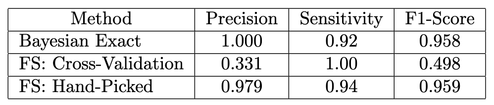
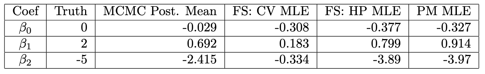
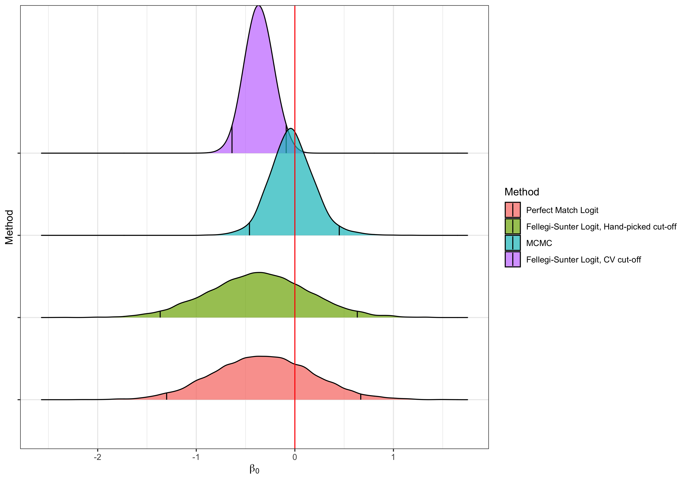
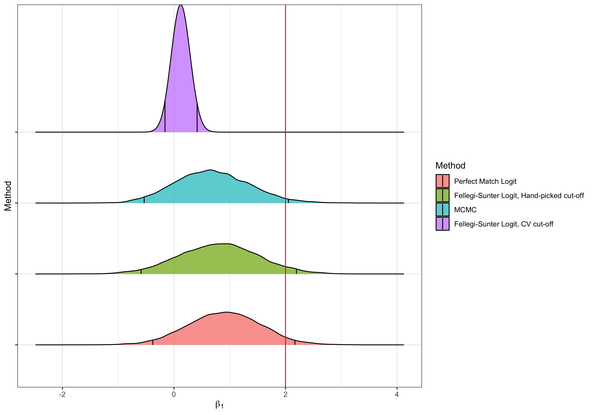
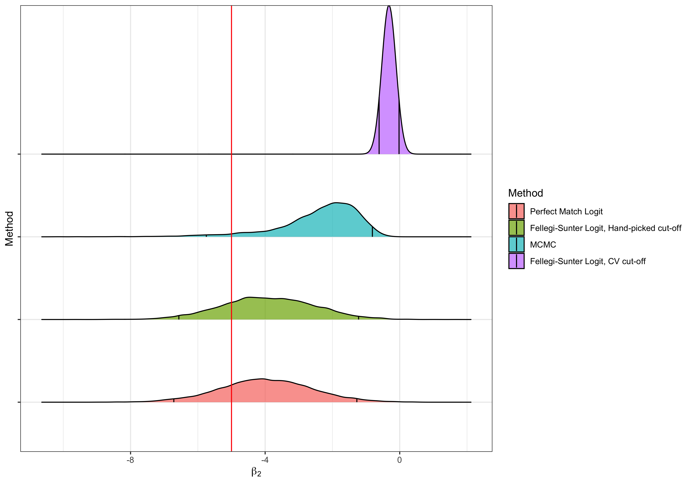

[Back to Main Site](https://davis-berlind.github.io/)

## 1 Background

Suppose we have two separate data sets containing demographic information for the same population and we would like to merge these records, but we lack unique identifiers to base the merge on. As digital record keeping and data collection has proliferate, this scenario has become increasingly common. @fellegi-sunter introduced the first *record linkage* method that enabled the matching entities (e.g. people, companies, or products) across databases in the absence of unique identifiers. @blink2015 introduced one of the first Bayesian methods for record linkage, which provided an intuitive approach to quantifying uncertainty around the matches. 

Record linkage is often a preliminary step in performing some more complex analysis, e.g. we may have covariates in one data set and outcome data in another and we need to merge the records in order to perform some predictive task. @steorts2018generalized extended the Bayesian framework of @blink2015 to handle the joint task of record linkage and linear regression. Their approach had the advantage of exact error propagation: any uncertainty from the linkage step is reflected in the regression estimates. The assumption of Gaussian data allowed @steorts2018generalized to marginalize out the latent covariates in their regression, and just use the observed data, but it eliminates the possibility of a limited dependent variable. In this post, I introduce a model based on @steorts2018generalized that does not require an explicit assumptions on the data generating process for the covariates. I will use this model to jointly link one database with a binary outcome to another containing potential covariates, then estimates a downstream logistic regression. 

## 2 Model 

Suppose that we have two databases $\mathcal{D}_1$ and $\mathcal{D}_2$ that consist of records $R_{ij}$, where $i\in\{1,2\}$ indexes the database and $j\in\{1,\ldots,N_i\}$ indexes the record. Each record has $K$ overlapping fields that can be used to link records across databases; we denote this subset of $R_{ij}$ as $V_{ij} = \{V_{ijk}\}_{k=1}^K$. Each $V_{ijk}$ is assumed to be categorical with $m\in\{1,\ldots,M_k\}$ representing the possible labels for the $k^{\text{th}}$ field. If $i = 1$, then $R_{ij}$ has an additional field $Y_{j}\in\{0,1\}$ that represents a binary response. Similarly, if $i=2$, then $R_{ij}$ has $P$ additional fields $\{X_{jp}\}_{p=1}^P$ that represent covariates. Our aim is to determine which records in $\mathcal{D}_1$ match to records in $\mathcal{D}_2$, then conditional on that matching, regress $\{Y_{j}\}_{j=1}^{N_1}$ on $\{X_{j}\}_{j=1}^{N_2}$. 

We assume that there are $N_{\text{pop}}$ latent entities indexed by $\ell\in\{1,\ldots,N_{\text{pop}}\}$. The latent entities have an associated set of true field values $\{(\widetilde{V}_\ell,\widetilde{Y}_\ell, \widetilde{X}_\ell)\}_{\ell=1}^{N_\text{pop}}$. The records we observe are (potentially) distorted versions of these true underlying values. To keep track of which latent entity generates which observed records, we define a *linkage structure*, $$\Lambda = \left\{\{\lambda_{ij}\}_{j=1}^{N_i} : i = 1,2\right\}$$ where $\lambda_{ij} = \ell$ implies that the $j^{\text{th}}$ record in the $i^{\text{th}}$ database is generated by the $\ell^{\text{th}}$ latent entity. We assume that is possible for $V_{ijk} \neq \widetilde{V}_{\lambda_{ij}k}$. In this case we say that there is distortion, which we model with the latent indicator $Z_{ijk}$, so that $Z_{ijk} = 1$ if the $k^{\text{th}}$ field of the $ij^{\text{th}}$ record is distorted. 

### 2.1 Independent Fields Model

Assume that each of the $K$ latent field values are generated independently across latent entities and across each field. Given a vector of probabilities $\theta_k$ over the $M_k$ values appearing in the $k^{\text{th}}$ field we have 
\begin{align*}
    \widetilde{V}_{\ell k} \;|\; \theta_k &\overset{\text{i.i.d.}}{\sim} \text{Multinomial}(1, \theta_k) \\
    \widetilde{V}_{\ell k} &\;\perp \widetilde{V}_{\ell k'} \text{ if } k\neq k' \\
    \theta_k &\overset{\text{ind.}}{\sim}  \text{Dirichlet}(\pmb{\eta}_k).
\end{align*}
We also assume that distortion occurs independently both across fields and records, so that given the distortion probability $\alpha_k$ for the $k^{\text{th}}$ field we have
\begin{align*}
    Z_{ijk} \;|\; \alpha_k &\overset{\text{i.i.d.}}{\sim} \text{Bernoulli}(\alpha_k) \\
    Z_{ijk} &\;\perp Z_{i'j'k} \text{ if } (i,j) \neq (i',j')  \\
    \alpha_k &\overset{\text{ind.}}{\sim} \text{Beta}(a_k, b_k).
\end{align*}
Conditional on latent field values, the distortion indicators, and the linkage structure, we assume that the observed records are independently generated by the following "hit-and-miss" model,[^1][^2]
\begin{align*}
    V_{ijk} \;|\; \lambda_{ij}, \widetilde{V}_{\lambda_{ij}k}, Z_{ijk}, \theta_k &\sim
    \begin{cases}
        \delta_{\widetilde{V}_{\lambda_{ij}k}}, & \text{if } Z_{ijk} = 0, \\
        \text{Multinomial}(1, \theta_k), & \text{if } Z_{ijk} = 1.
    \end{cases} \\
    V_{ijk} &\perp V_{i'j'k'} \text{ if } (i,j,k) \neq (i',j',k')
\end{align*}
Finally, we assume that $p(\Lambda) \propto 1$, which captures the assumption that each legitimate configuration of $\Lambda$ is equally likely *a priori*.

### 2.2 Logistic Regression Model

We adopt the following logistic regression model from @casella,
\begin{align*}
    \widetilde{Y}_{\ell} \;|\; \widetilde{X}_{\ell}, \beta_0, \beta &\overset{\text{ind.}}{\sim} \text{Bernoulli} \left(\frac{\exp\left(\beta_0 + \widetilde{X}'_{\ell}\beta\right)}{1 + \exp\left(\beta_0 + \widetilde{X}'_{\ell}\beta\right)}\right) \\
    \beta_0 &\;\sim \frac{\exp(\beta_0)}{b_0} \exp\left(-\frac{\exp(\beta_0)}{b_0}\right)  \\
    \beta &\;\sim \mathcal{N}_P(\mu_\beta, \Sigma_\beta) \\
    \beta_0 &\;\perp \beta \perp \widetilde{X}_\ell
\end{align*}
We also assume that, conditional on $\widetilde{Y}_{\lambda_{1j}}$ and $\widetilde{X}_{\lambda_{2j}}$ respectively, $Y_{j}$ and $X_{j}$ are generated independently within their respective databases, and finally that $Y_{j} \perp V_{1j}$ and $X_{j} \perp V_{2j}$, so there is no relation between the fields we are using for matching and those we are using for regression.

We make two simplifying assumptions for this model: i) there is no duplication within databases, i.e. if $j \neq j'$, then $\lambda_{ij} \neq \lambda_{ij'}$, and ii) there is no distortion in the regression data, so that conditional on $\lambda_{ij}$, we have 
\begin{align*}
    Y_{j} &= \widetilde{Y}_{\lambda_{1j}} \\
    X_{j} &= \widetilde{X}_{\lambda_{2j}}.
\end{align*}
One subtlety of this approach is that we may end up with a configuration of $\Lambda$ for which there exists a latent entity indexed by $\ell$ such that $$\{i : \lambda_{ij} = \ell\} = 1 \text{ or } \{i : \lambda_{ij} = \ell\} = 2.$$ In other words, there may be a latent entity that points to an individual that appears in one data set, but not both. In this case the density $p(Y_{j}, X_{j'} \;|\; \lambda_{1j} = \lambda_{j'} = \ell)$ will collapse to the marginal density of either $Y_{j}$ or $X_{j'}$. Furthermore, because there is no distortion in this regression model, all of the information we have about $(\widetilde{Y}_\ell, \widetilde{X}_\ell)$ is captured by $\{(Y_{j}, X_{j'}) : \lambda_{1j} = \lambda_{j'} = \ell\}$, so we can effectively drop $\widetilde{Y}_\ell$ and $\widetilde{X}_\ell$ from the model. 

### 2.3 Posterior Distributions

The full posterior distribution for this model is given by
\begin{align*}
    p\left(\Lambda, \widetilde{\mathbf{V}}, \mathbf{Z}, \pmb{\alpha}, \pmb{\theta}, \beta \;|\; \mathbf{V}, \mathbf{Y}, \mathbf{X}\right) &\propto p(\mathbf{V} \;|\; \Lambda, \widetilde{\mathbf{V}}, \mathbf{Z}, \pmb{\alpha}, \pmb{\theta}) p(\widetilde{\mathbf{V}} \;|\; \Lambda, \pmb{\theta})p(\pmb{\theta)} p(\mathbf{Z}\;|\; \pmb{\alpha})p(\pmb{\alpha}) \tag{Matching Model} \\
    &\quad \times p(\mathbf{Y}, \mathbf{X} \;|\; \Lambda,\beta)p(\beta) \tag{Regression Model} \\
    &\quad \times p(\Lambda)
\end{align*}
Focusing on the term $p(\mathbf{Y}, \mathbf{X} \;|\; \Lambda,\beta)$, we can define the sets 
\begin{align*}
    S_y &= \{\ell : \exists j \text{ s.t. } \lambda_{1j} = \ell \text{ and } \nexists j' \text{ s.t. } \lambda_{j'} = \ell\} \\
    S_y &= \{\ell : \nexists j \text{ s.t. } \lambda_{1j} = \ell \text{ and } \exists j' \text{ s.t. } \lambda_{j'} = \ell\} \\
    S_{xy} &= \{1, \ldots, N_\text{pop}\} \setminus \{S_y \cup S_x\}.
\end{align*}
Then we have
\begin{align*}
    p(\mathbf{Y}, \mathbf{X} \;|\; \Lambda,\beta) &= p(\widetilde{\mathbf{Y}}, \widetilde{\mathbf{X}} \;|\; \Lambda, \beta) \\ 
    &= \prod_{\ell \in S_y} p(\widetilde{Y}_\ell \;|\;\beta) \prod_{\ell \in S_x} p(\widetilde{X}_\ell) \prod_{\ell \in S_{xy}} p(\widetilde{Y}_\ell \;|\; \widetilde{X}_\ell, \beta) p(\widetilde{X}_\ell) \tag{$\widetilde{X}_\ell \perp \beta$}\\
    &= \prod_{\ell \in S_y} \int_{X_\ell} \left(\frac{\exp\left(\beta_0 + \widetilde{x}'_{\ell}\beta\right)}{1 + \exp\left(\beta_0 + \widetilde{x}'_{\ell}\beta\right)}\right)^{\widetilde{Y}_\ell}\left(\frac{1}{1 + \exp\left(\beta_0 + \widetilde{x}'_{\ell}\beta\right)}\right)^{1 - \widetilde{Y}_\ell} p(\widetilde{x}_\ell) \; d \widetilde{x}_\ell \\
    &\quad \times \prod_{\ell \in S_{xy}} \left(\frac{\exp\left(\beta_0 +  \widetilde{X}'_{\ell}\beta\right)}{1 + \exp\left(\beta_0 +  \widetilde{X}'_{\ell}\beta\right)}\right)^{\widetilde{Y}_\ell}\left(\frac{1}{1 + \exp\left(\beta_0 + \widetilde{X}'_{\ell}\beta\right)}\right)^{1 - \widetilde{Y}_\ell} \\
    &\quad \times \prod_{\ell \in S_x \cup S_{xy}} p(\widetilde{X}_\ell).
\end{align*}
Note that $S_x \cup S_{xy}$ is just the set of latent entities pointing to an observed record of $X_{2j}$, i.e. $$\{\widetilde{X}_\ell : \ell \in S_x \cup S_{xy}\} = \mathbf{X},$$ so the last line above simplifies to $p(\mathbf{X})$. Rewriting $p(\mathbf{Y}, \mathbf{X} \;|\; \Lambda,\beta)$ in terms of the observed data (and using the assumption that the data generating process for $X_\ell$ is the same across $\ell$), we have 
\begin{align*}
    p(\mathbf{Y}, \mathbf{X} \;|\; \Lambda,\beta) &\underset{\Lambda, \beta}{\propto} \prod_{j\;:\;\lambda_{1j} \in S_y} \int_{X} \left(\frac{\exp\left(x'\beta\right)}{1 + \exp\left(\beta_0 + x'\beta\right)}\right)^{Y_{\lambda_{1j}}}\left(\frac{1}{1 + \exp\left(\beta_0 + x'\beta\right)}\right)^{1 - Y_{\lambda_{1j}}} p(x) \; dx \\
    &\quad \times \prod_{\substack{(j,j') \;:\; \lambda_{1j}=\lambda_{j'}}}   \left(\frac{\exp\left(\beta_0 + X'_{j'}\beta\right)}{1 + \exp\left(\beta_0 + X'_{j'}\beta\right)}\right)^{Y_{j}}\left(\frac{1}{1 + \exp\left(\beta_0 + X'_{j'}\beta\right)}\right)^{1 - Y_{j}}.
\end{align*}
Plugging in the rest of out parametric forms, we have
\begin{align*}
    p\left(\Lambda, \widetilde{\mathbf{V}}, \mathbf{Z}, \pmb{\alpha}, \pmb{\theta}, \beta \;|\; \mathbf{V}, \mathbf{Y}, \mathbf{X}\right) &\propto \prod_{i,j,k,m} \left[(1-Z_{ijk})\delta_{\widetilde{V}_{\lambda_{ij}k}}(V_{ijk}) + Z_{ijk}\theta_{km}^{\mathbf{1}\{V_{ijk} = m\}}\right] \\
    &\quad \times \prod_{k,m} \theta_{km}^{\eta_{km} -1 + \sum_{\ell = 1}^{N_\text{pop}}\mathbf{1}\{\widetilde{V}_{\ell k} = m\}}\\
    &\quad \times \prod_{k} \alpha_k^{a_k - 1 +\sum_{i=1}^2\sum_{j=1}^{N_i} Z_{ijk}} (1-\alpha_k)^{b_k - 1 +\sum_{i=1}^2\sum_{j=1}^{N_i} (1-Z_{ijk})} \\
    &\quad \times \prod_{j\;:\;\lambda_{1j} \in S_y} \int_{X} \left(\frac{\exp\left(x'\beta\right)}{1 + \exp\left(x'\beta\right)}\right)^{Y_{\lambda_{1j}}}\left(\frac{1}{1 + \exp\left(\beta_0 + x'\beta\right)}\right)^{1 - Y_{\lambda_{1j}}} p(x) \; d x \\
    &\quad \times \prod_{\substack{(j,j') \;:\; \lambda_{1j}=\lambda_{j'}}}  \left(\frac{\exp\left(\beta_0 + X'_{j'}\beta\right)}{1 + \exp\left(\beta_0 + X'_{j'}\beta\right)}\right)^{Y_{j}}\left(\frac{1}{1 + \exp\left(\beta_0 + X'_{j'}\beta\right)}\right)^{1 - Y_{j}}.
\end{align*}

We simulate the posterior distribution via Gibbs sampling. We can directly draw from the full conditional distributions for $\pmb{\alpha}$ and $\pmb{\theta}$
\begin{align*}
    \alpha_k \;|\; \Lambda, \widetilde{\mathbf{V}}, \mathbf{Z}, \pmb{\theta}, \beta, \mathbf{V}, \mathbf{Y}, \mathbf{X} &\overset{\text{ind.}}{\sim} \text{Beta}\left(a_k +\sum_{i=1}^2\sum_{j=1}^{N_i} Z_{ijk},\; b_k  +\sum_{i=1}^2\sum_{j=1}^{N_i} (1-Z_{ijk})\right) \\
    \theta_k \;|\; \Lambda, \widetilde{\mathbf{V}}, \mathbf{Z}, \pmb{\alpha}, \beta, \mathbf{V}, \mathbf{Y}, \mathbf{X} &\overset{\text{ind.}}{\sim} \text{Dirichlet}(\pmb{\eta}_k + \mathbf{c}_k)
\end{align*}
where $\mathbf{c}_k = \{c_m\}_{m=1}^{M_k}$ and $$c_m = \left[\sum_{\ell=1}^{N_\text{pop}} \mathbf{1}\{\widetilde{V}_{\ell k} = m\}\right] + \left[\sum_{i=1}^2\sum_{j=1}^{N_i} \mathbf{1}(V_{ijk}=m)Z_{ijk}\right].$$ 

Next, note that if $Z_{ijk} = 0$ and $\lambda_{ij} = \ell$, then we know $\widetilde{V}_{\ell k} = V_{ijk}$. On the other hand, if $Z_{ijk} = 1$, then $\widetilde{V}_{\ell k}$ is just a draw from $\text{Multinomial}(1, \theta_k)$, so we have 
\begin{align*}
     \widetilde{V}_{\ell k} \;|\; \Lambda, \mathbf{Z}, \pmb{\alpha}, \pmb{\theta}, \beta, \mathbf{V}, \mathbf{Y}, \mathbf{X} &\overset{\text{ind.}}{\sim} 
     \begin{cases}
         \delta_{V_{ijk}}, & \text{if } \exists\; (i,j) \text{ s.t. } \lambda_{ij} = \ell \text{ and } Z_{ijk} = 0, \\
         \text{Multinomial}((1, \theta_k), &\text{ otherwise.}
     \end{cases}
\end{align*}
Similarly, if $V_{ijk} \neq \widetilde{V}_{\lambda_{ij}k}$, then we know $Z_{ijk} = 1$. On the other hand, if $V_{ijk} = \widetilde{V}_{\lambda_{ij}k}$, then we need to calculate 
\begin{align*}
    P(Z_{ijk} = 1 \;|\; \Lambda, \widetilde{\mathbf{V}}, \pmb{\alpha}, \pmb{\theta}, \beta, \mathbf{V}, \mathbf{Y}, \mathbf{X}) = \frac{P(\Lambda, \widetilde{\mathbf{V}}, \pmb{\alpha}_{-k}, \pmb{\theta}, \beta, \mathbf{V}, \mathbf{Y}, \mathbf{X} \;|\; Z_{ijk} = 1, \alpha_k)P(Z_{ijk} = 1 \;|\; \alpha_k) }{\sum_{z\in\{0,1\}} P(\Lambda, \widetilde{\mathbf{V}}, \pmb{\alpha}_{-k}, \pmb{\theta}, \beta, \mathbf{V}, \mathbf{Y}, \mathbf{X} \;|\; Z_{ijk} = z, \alpha_k)P(Z_{ijk} = z\;|\;\alpha_k)}
\end{align*}
But by the previous conditional independence results, we have
\begin{align*}
     p(\Lambda, \widetilde{\mathbf{V}}, \pmb{\alpha}_{-k}, \pmb{\theta}, \beta, \mathbf{V}, \mathbf{Y}, \mathbf{X} \;|\; Z_{ijk}, \alpha_k)p(Z_{ijk} \;|\; \alpha_k) &\underset{Z_{ijk}}{\propto} \prod_{m=1}^{M_k} \left[(1-Z_{ijk})\delta_{\widetilde{V}_{\lambda_{ij}k}}(V_{ijk}) + Z_{ijk}\theta_{km}^{\mathbf{1}\{V_{ijk} = m\}}\right] \\
    &\quad \times \alpha_k^{a_k - 1 + Z_{ijk}} (1-\alpha_k)^{b_k - Z_{ijk}} \\
    &= \prod_{m=1}^{M_k} \left[(1-Z_{ijk}) + Z_{ijk}\theta_{km}^{\mathbf{1}\{V_{ijk} = m\}}\right] \alpha_k^{a_k - 1 + Z_{ijk}} (1-\alpha_k)^{b_k - Z_{ijk}} \tag{assumed $\widetilde{V}_{\lambda_{ij}k} = V_{ijk}$}
\end{align*}
which gives
\begin{align*}
    P(Z_{ijk} = 1 \;|\; \Lambda, \widetilde{\mathbf{V}}, \pmb{\alpha}, \pmb{\theta}, \beta, \mathbf{V}, \mathbf{Y}, \mathbf{X}) = \frac{\alpha_k  \prod_{m=1}^{M_k} \theta_{km}^{\mathbf{1}\{V_{ijk} = m\}}}{(1-\alpha_k) + \alpha_k  \prod_{m=1}^{M_k} \theta_{km}^{\mathbf{1}\{V_{ijk} = m\}}}
\end{align*}
and 
\begin{align*}
    Z_{ijk} \;|\; \Lambda, \widetilde{\mathbf{V}}, \pmb{\alpha}, \pmb{\theta}, \beta, \mathbf{V}, \mathbf{Y}, \mathbf{X} &\overset{\text{ind.}}{\sim} \text{Bernoulli}(\pi_{ijk}) \\
    \pi_{ijk} &=
    \begin{cases}
        1, & \text{if } V_{ijk} \neq \widetilde{V}_{\lambda_{ij}k}, \\
        \frac{\alpha_k  \prod_{m=1}^{M_k} \theta_{km}^{\mathbf{1}\{V_{ijk} = m\}}}{(1-\alpha_k) + \alpha_k  \prod_{m=1}^{M_k} \theta_{km}^{\mathbf{1}\{V_{ijk} = m\}}}, & \text{if } V_{ijk} = \widetilde{V}_{\lambda_{ij}k}.
    \end{cases}
\end{align*}
We do not have a closed form solution for the posterior distribution of $\Lambda$, but we can use a Metropolis step to sample new configurations of the linkage structure, with the caveat that the Metropolis step must reject any proposal that would give $Z_{ijk} = 0$ and $V_{ijk} \neq \widetilde{V}_{\lambda_{ij}k}$ or $\lambda_{ij} = \lambda_{ij'}$ for some $j \neq j'$. In practice we use the SMERE algorithm first introduced in @pmlr-v33-steorts14 to generate posterior samples of $\Lambda$.

We can also use a Metropolis step to draw samples from the full conditional distribution of $\beta$. However, for this step there is the added wrinkle that we need to calculate the integral
\begin{align*}
    \int_{X} \left(\frac{\exp\left(\beta_0 + x'\beta\right)}{1 + \exp\left(\beta_0 +  x'\beta\right)}\right)^{Y_j}\left(\frac{1}{1 + \exp\left(\beta_0 +  x'\beta\right)}\right)^{1 - Y_j} p(x) \; d x.
\end{align*}
We do not have a closed form solution for this integral, so we propose using kernel density estimation to generate an approximation $\hat{p}(x)$ which we can then use to calculate this integral numerically. In particular we used the `ks` package in R to estimate $\hat{p}(x)$ (@ks). A full implementation of the Gibbs sampler is given at the end of this post.

## 3 Simulation Study

As in @steorts2018generalized, we can test the proposed method using data generated from the `RL500` data set found in the `blink` package developed by @blink. `RL500` is a synthetic data set that contains variables on which we can perform the matching operations, including variables for first and last name, and birth day, month, and year. Of the 500 records, 50 are duplicates, meaning that the 500 records refer to a total of 450 unique individuals. Each duplicate contains at least one typographical error. Some errors are meant to represent typing mistakes, while others are alternate spellings of homophones. These errors create the difficulty in matching the duplicated records to each other.

I augment the `RL500` data set with the covariates, $X_\ell$, and the response variable, $Y_\ell$, for the logistic regression task. Next, we can fix a $\beta$ vector at $(2, -5)^T$ and sample the covariates from a multivariate normal distribution
\begin{align*}
    X_\ell \overset{\text{i.i.d.}}{\sim} N_2\left( \begin{bmatrix} 0 \\ 0\end{bmatrix},\, \begin{bmatrix} 1 & -0.3 \\ -0.3 & 1 \\   \end{bmatrix} \right).
\end{align*}
The response variables $Y_\ell$ are then sampled conditional on $X_\ell$ according to the logistic model.

Note that in this sampling design, each of the `RL500` duplicates has an identical value for $X_\ell$ and $Y_\ell$. After augmenting the matching data with the simulated regression data, the data set is split into two equally sized databases. Each database receives 200 unique individuals, with no match in the other database, and 50 of the 100 total duplicates. The first database receives the matching variables along with the response variable, while the second database receives the matching variables and the covariates. 

We have two goals. First, correctly match the duplicates between the two databases, while rejecting matches for observations that do not have a true link. Second, perform a logistic regression conditional on these matches to estimate the posterior distribution of the beta coefficients. 


To benchmark the performance of our method, we can also link our constructed data sets using a modified version of the method first introduced by @fellegi-sunter as it is implemented in the `RecordLinkage` package in (@recordlinkage). The Fellegi-Sunter method is a Frequentist probabilistic method that assigns weights to each possible match with more likely matches getting higher weights. Since our method enforces injective correspondences between the two databases, we choose the most likely match proposed by Fellegi-Sunter and designate any other links across databases as non-matches. If more than one observation is matched to one observation in the other database we again picked the more likely of the two matches. 

We must choose a cutoff for accepting or rejecting each proposed match. This threshold is chosen via cross-validation. Using the larger `RL10000` data set, I randomly construct data sets with 500 observations and 20\% duplication as analogues to `RL500`. I construct 1,000 such data set, estimate the linkage structure with our modified Fellegi-Sunter procedure, and calculate the average F1-score along a grid of cut-offs. The cross-validation curve with 95\% quantiles is depicted in Figure 1. We see that the F1-score is no longer increase after zero, so heuristically it makes sense to place the threshold here and avoid the risk of over-fitting that come with a higher threshold. That being said, the matching results in `RL500` are improved by choosing a higher cut-off near 12, and at this cut-off the regression on the Fellegi-Sunter matches will outperform our model.

For the Bayesian model introduced above, I chose uniform, uninformative priors over each of the model parameters with the exception of the distortion probabilities $\alpha_k$. The choice of $a_k$ and $b_k$ is the only subjective choice in this model. @Steorts2014EntityRW previously showed that without accounting for string distance or more nuanced forms of distortion, the posterior number of true entities is extremely sensitive to the choice of $a_k$ and $b_k$, but that a choice of $a_k = 1$ and $b_k = 9999$ (which corresponds to a prior distortion probability of 1 in 10,000) results in a posterior number of latent entities that is stable around the truth. I choose this parameter setting in our simulation as well. I ran this MCMC algorithm for 10,000 Gibbs iterations, with 5 metropolis proposal per iteration, and 100 split-merge proposals per metropolis step, or a total of 5,000,000 iterations, and removed the first 2,000 retained Gibbs samples as burn-in, leaving a final chain of 8,000 iterations.

To compare the quality of our matching results with Fellegi-Sunter, I chose to declare two records as linked if their posterior probability of being linked is greater than half, i.e. we link $R_{1j}$ and $R_{2j'}$ if 
\begin{align*}
    \frac{1}{G} \sum_{g=1}^G \mathbf{1}\{\lambda^{(g)}_{1j} = \lambda^{(g)}_{2j'}\} \geq 0.5. 
\end{align*}
For both cut-off values of Fellegi-Sunter, we link records that have weights greater than the cut-off. We can then calculate the precision, sensitivity, and F1-score based on these matches. From the results in Table 1, we can see that our method and the hand-picked Fellegi-Sunter have very similar precision and sensitivities with nearly identical F1-scores, while the cross-validation Fellegi-Sunter had the best sensitivity but very low precision. 



Next, for each Frequentist method, using the response and covariate variables from the matched observations, we calculate the MLE and standard errors for the logistic regression model. In Table 2, we compare the true values of the coefficients with the posterior means of our MCMC chains, the MLE values for Fellegi-Sunter with the cross-validation and hand-picked cut-offs, and the perfectly matched MLE, using just the observations that are truly linked. In this table, we can see that the perfectly matched MLE is the closest to the truth for the non-intercept coefficients, followed by the hand-picked Fellegi-Sunter and our MCMC posterior mean. The Fellegi-Sunteer with the cross-validation cut-off performs very poorly. This makes sense in light of the low precision of the method, since it is effectively fitting the model to many observations with independent covariate and response values.



Finally, we want to compare our MCMC estimate of the posterior distribution with the estimated asymptotic normal distributions of the MLE for the Frequentist methods. In Figures 2-4 we can see the comparison of these distributions. Based on this comparison, the perfect match MLE seems to have the best distribution, having a mean value closest to the truth, while also representing the uncertainty in only having 50 observations. By these same criteria, the hand-picked cut-off Fellegi-Sunter seems to be perform the second-best, our method third, and the cross-validation Fellegi-Sunter fourth.






Based on these results, it appears that the Fellegi-Sunter method with a hand-tuned cut-off performs similarly to our method in the matching task and outperform our method in the regression task. However, in most real world record linkage scenarios, we do not have access to unique identifying information, so it is not possible to tune a model like Fellegi-Sunter. We are more likely to have to rely on a heuristic cut-off like the one we found via cross-validation. We see that our unsupervised approach to linking records strongly outperforms Fellegi-Sunter in this case, both in terms of providing better point estimates and in properly capturing the uncertainty around the parameters that Felleig-Sunter completely misses due to treating the estimate linkage structure as certain.

## 4 Gibbs Sampler

```{r, eval=FALSE}
library(RecordLinkage)
library(mvtnorm)
library(dplyr)
library(MCMCpack)
library(ks)

emp_dist <- function(data, key_vars){
  emp_freqs <- list()
  for (key_var in key_vars) {
    emp_freq <- data %>%
      dplyr::select(key_var) %>%
      table %>%
      prop.table %>%
      data.frame
    names(emp_freq) <- c(paste0(key_var), "freq")
    emp_freqs[[key_var]] <- emp_freq
  }
  return(emp_freqs)
}

grab_x <- function(link, data, cov_names) {
  data[data$link == link & data$file == "x", cov_names]
}

grab_y <- function(link, data) {
  data[data$link == link & data$file == "y", "y"]
}

logitRL <- function(y_data, x_data, key_vars, S_g, S_m = 1, S_t = 1,
                    eta = NULL, a = NULL, b = NULL, mu = NULL, Sigma = NULL,
                    weighting = "emperical", a0 = 0) {
  
  # augmenting data
  x_data$intercept <- 1
  cov_names <- names(x_data)[!(names(x_data) %in% key_vars)]
  y_data[cov_names] <- NA
  y_data$file <- "y"
  x_data$y <- NA
  x_data$file <- "x"
  full_data <- rbind(y_data, x_data)
  X <- as.matrix(x_data[,cov_names])

  # model parameters
  K <- length(key_vars)
  P <- length(cov_names)
  N <- nrow(full_data)
  Nx <- nrow(x_data)
  Ny <- nrow(y_data)
  if (weighting == "emperical") {
    wts <- rep(1/Nx, Nx)
  } else if (weighting == "kde") {
    kdens <- kde(x_data[,cov_names[!(cov_names %in% "intercept")]])
    wts <- predict(kdens, x = x_data[,cov_names[!(cov_names %in% "intercept")]])
    wts <- wts / sum(wts)
  } else if (weighting == "normal") {
    # TODO: need to update weights within sampler
  }
  
  # initialize linkage structure
  full_data$link <- as.character(1:nrow(full_data))
  linkage_chain <- matrix(nrow = S_g, ncol = N)
  
  # default priors
  b0 <- exp(a0 - digamma(1))
  if (is.null(a)) a <- rep(1, K)
  if (is.null(b)) b <- rep(1, K)
  if (is.null(mu)) mu <- rep(0, P)
  if (is.null(Sigma)) Sigma <- diag(100, P)
  if (all(diag(diag(Sigma)) == Sigma)) {
    log_beta_prior <- function(x, mu, Sigma) {
      sum(mapply(dnorm, x = x, mean = mu, sd = sqrt(diag(Sigma)), log = TRUE))
    } 
  } else {
    log_beta_prior <- function(x, mu, Sigma) {
      dmvnorm(x, mean = mu, sigma = Sigma, log = TRUE)
    } 
  }
  
  if(is.null(eta)) {
    eta <- list()
    for (var in key_vars) {
      eta[[var]] <- rep(1, length(unique(full_data[var])))
    }
  }
  
  # initialize thetas
  thetas <- emp_dist(full_data, key_vars)
  theta_chain <- list()
  for (var in key_vars) {
    theta_chain[[var]] <- matrix(nrow = S_g, ncol = nrow(thetas[[var]]))
  }
  
  # initialize true field values
  V_true <- list()
  for (v in full_data$link) {
    V_true[[v]] <- full_data[full_data$link == v, key_vars]
  }
  
  V_df <- do.call(rbind, V_true)
  V_counts <- list()
  for (var in key_vars) {
    var_count <- data.frame(count = colSums(outer(V_df[[var]], unique(full_data[[var]]), `==`)))
    var_count[[var]] <- unique(full_data[[var]])
    V_counts[[var]] <- var_count[order(var_count[[var]]),]
  }
  
  # initialize distortion
  alphas <- data.frame(key_vars = key_vars, alpha = rep(0, K))
  alpha_chain <- matrix(nrow = S_g, ncol = K)
  Z <- data.frame(matrix(FALSE, nrow = N, ncol = K))
  names(Z) <- key_vars
  
  # initialize beta
  betas <- rep(0, P)
  beta_chain <- matrix(nrow = S_g, ncol = P)
  colnames(beta_chain) <- cov_names
  
  # progress bar
  pb = txtProgressBar(min = 1, max = S_g, initial = 1, style = 3)
  
  # sampler
  for (s in 1:S_g) {
    setTxtProgressBar(pb,s)
    
    # theta gibbs update
    for (var in key_vars) {
      cnt <- colSums(outer(full_data[[var]][Z[[var]]], V_counts[[var]][[var]], `==`))
      c_k <- V_counts[[var]][["count"]] + cnt
      thetas[[var]]$freq <- c(rdirichlet(1, eta[[var]] + c_k))
      theta_chain[[var]][s,] <- thetas[[var]]$freq
    }
    
    # alpha gibbs update
    a_post <- a + apply(Z, 2, sum)
    b_post <- b + apply((1-Z), 2, sum)
    alphas$alpha <- mapply(function(a,b) rbeta(n = 1, a, b), a_post, b_post)
    alpha_chain[s,] <- alphas$alpha
    
    # regression data
    linked <- full_data$link[duplicated(full_data$link)]
    if (length(linked) > 0) {
      X_comp <- lapply(linked, grab_x, data = full_data, cov_names = cov_names) %>% 
        do.call(rbind, .) %>% 
        as.matrix
      y_comp <- sapply(linked, grab_y, data = full_data)
    }
    y_miss <- full_data$y[full_data$file == "y" & !(full_data$link %in% linked)]
    
    for (m in 1:S_m) {
      
      # beta metropolis update
      for (p in 1:P) {
        betas_prop <- betas
        if(cov_names[p]== "intercept") {
          betas_prop[p] <- log(rexp(1, 1 / b0))
          log.r <- 0
        } else { 
          betas_prop[p] <- rnorm(1, mean = betas[p])
          log.r <- log_beta_prior(betas_prop, mu, Sigma) - log_beta_prior(betas, mu, Sigma)
        }
        
        XB <- X %*% betas
        XB_prop <- X %*% betas_prop
        pr <- exp(XB) / (1 + exp(XB))
        pr_prop <- exp(XB_prop) / (1 + exp(XB_prop))
        
        log_mean_p1 <- log(sum(wts * pr))
        log_mean_p0 <- log(sum(wts * (1 - pr)))
        
        log_mean_p1_prop <-  log(sum(wts * pr_prop))
        log_mean_p0_prop <- log(sum(wts * (1 - pr_prop)))
        
        if (length(linked) > 0) {
          XB_comp <- X_comp %*% betas
          pr_comp <- exp(XB_comp) / (1 + exp(XB_comp))
          XB_comp_prop <- X_comp %*% betas_prop
          pr_comp_prop <- exp(XB_comp_prop) / (1 + exp(XB_comp_prop))
          log.r <- log.r + sum(y_comp * (XB_comp_prop - XB_comp) + log(1 + exp(XB_comp)) - log(1 + exp(XB_comp_prop)))
        }

        log.r <- log.r + sum(y_miss) * (log_mean_p1_prop - log_mean_p1) + (length(y_miss) - sum(y_miss)) * (log_mean_p0_prop - log_mean_p0)
        
        if (log(runif(1)) < log.r) {
          betas <- betas_prop
          log_mean_p0 <- log_mean_p0_prop
          log_mean_p1 <- log_mean_p1_prop
        } 
      }
      
      # V update
      for (var in key_vars) {
        for (i in 1:length(V_true)) {
          v <- names(V_true)[i]
          if (all(Z[[var]][full_data$link == v])) {
            V_true[[v]][[var]] <- sample(thetas[[var]][[var]], 1, prob = thetas[[var]]$freq)
          } else {
            V_true[[v]][[var]] <- full_data[[var]][full_data$link == v & !Z[[var]]][1]
          }
        }
      }
      
      # Z update
      for (var in key_vars) {
        alpha_k <- alphas[alphas$key_vars == var, "alpha"]
        for (i in 1:N) {
          v_ijk <- full_data[[var]][i]
          if (v_ijk != V_true[[full_data$link[i]]][[var]]) {
            Z[[var]][i] <- TRUE
          } else {
            theta_km <- thetas[[var]]$freq[thetas[[var]][[var]] == v_ijk]
            p_ijk <- alpha_k * theta_km / (1-alpha_k + alpha_k * theta_km)
            Z[[var]][i] <- as.logical(rbinom(1, 1, p_ijk))
          }
        }
      }
      # linkage update
      for (t in 1:S_t) {
        log.r <- 0
        
        # sample two records to link or split
        while(TRUE) {
          idy <- sample(1:Ny, 1)
          idx <- sample((Ny+1):N, 1)
          linking <- full_data$link[idy] != full_data$link[idx]
          if (!linking) break # ok if splitting
          # if linking need to check no other entities linked to the sampled records
          if (sum(full_data$link %in% full_data$link[c(idy,idx)]) == 2) break
        }
        
        XB_sub <- as.matrix(full_data[idx, cov_names]) %*% betas
        
        Z_y_prop <- Z[idy,]
        Z_x_prop <- Z[idx,]
        Z_y_prop[1,] <- TRUE
        Z_x_prop[1,] <- TRUE
        
        # if linking, randomly select fields from sampled records to create new entity
        if (linking) {
          dex <- sample(c(TRUE, FALSE), size = K, replace = TRUE)
          v_prop <- full_data[idx, key_vars] 
          v_prop[,dex] <- full_data[idy, key_vars][dex] 
        }
        
        for (var in key_vars) {
          alpha_k <- alphas[alphas$key_vars == var, "alpha"]
          theta_y <- thetas[[var]]$freq[thetas[[var]][[var]] == full_data[[var]][idy]]
          theta_x <- thetas[[var]]$freq[thetas[[var]][[var]] == full_data[[var]][idx]]
          p_y <- alpha_k * theta_y / (1-alpha_k + alpha_k * theta_y)
          p_x <- alpha_k * theta_x / (1-alpha_k + alpha_k * theta_x)
          
          if (!linking) {
            Z_y_prop[[var]] <- as.logical(rbinom(1, 1, p_y))
            Z_x_prop[[var]] <- as.logical(rbinom(1, 1, p_x))
            theta_m <- thetas[[var]]$freq[thetas[[var]][[var]] == V_true[[full_data$link[idy]]][[var]]]
            log.r <- log.r + log(theta_y) + log(theta_x) - log(theta_m)
          } else {
            if (full_data[[var]][idy] == v_prop[[var]]) Z_y_prop[[var]] <- as.logical(rbinom(1, 1, p_y))
            if (full_data[[var]][idx] == v_prop[[var]]) Z_x_prop[[var]] <- as.logical(rbinom(1, 1, p_x))
            theta_m_y <- thetas[[var]]$freq[thetas[[var]][[var]] == V_true[[full_data$link[idy]]][[var]]]
            theta_m_x <- thetas[[var]]$freq[thetas[[var]][[var]] == V_true[[full_data$link[idx]]][[var]]]
            theta_m <- thetas[[var]]$freq[thetas[[var]][[var]] == v_prop[[var]]]
            log.r <- log.r + log(theta_m) - log(theta_m_y) - log(theta_m_x)
          }
          Z_y_diff <- Z_y_prop[[var]] -  Z[[var]][idy]
          Z_x_diff <- Z_x_prop[[var]] - Z[[var]][idx]
          log.r <- log.r + Z_y_diff * log(theta_y) + Z_x_diff * log(theta_x) 
          log.r <- log.r + (Z_y_diff + Z_x_diff) * (log(alpha_k) - log(1-alpha_k)) 
        }
        
        if(full_data$y[idy] == 1){
          log.r <- log.r + (1 - 2*linking) * (XB_sub - log(1 + exp(XB_sub)) - log_mean_p1)
        } else {
          log.r <- log.r + (1 - 2*linking) * (-log(1 + exp(XB_sub)) - log_mean_p0)
        }
        if (log(runif(1)) < log.r) {
          if (linking) {
            V_true[[full_data$link[idy]]] <- v_prop
            V_true[[full_data$link[idx]]] <- NULL
            full_data$link[idx] <- full_data$link[idy]
          } else {
            V_true[[full_data$link[idy]]] <- full_data[idy, key_vars]
            full_data$link[idx] <- as.character(min((1:N)[!(1:N %in% full_data$link)]))
            V_true[[full_data$link[idx]]] <- full_data[idx, key_vars]
          }
          Z[idx,] <- Z_x_prop
          Z[idy,] <- Z_y_prop
        }
      }
    }
    
    beta_chain[s,] <- betas
    linkage_chain[s,] <- full_data$link
    
    V_df <- do.call(rbind, V_true)
    for (var in key_vars) {
      V_counts[[var]][[var]] <- colSums(outer(V_df[[var]], V_counts[[var]][[var]], `==`))
    }
  }
  
  return(list(theta = theta_chain, 
              alpha = alpha_chain, 
              beta = beta_chain, 
              lambda = linkage_chain))
}
```

## Acknowledgment

This post was adapted from a project for STATS 201B at UCLA that I worked on with my colleague Kyle McEvoy. Thanks to Kyle for his help!

## References

[^1]: This independence assumption holds across databases, records, and fields.
[^2]: Here $\delta_v$ is a point-mass on the point $v$.