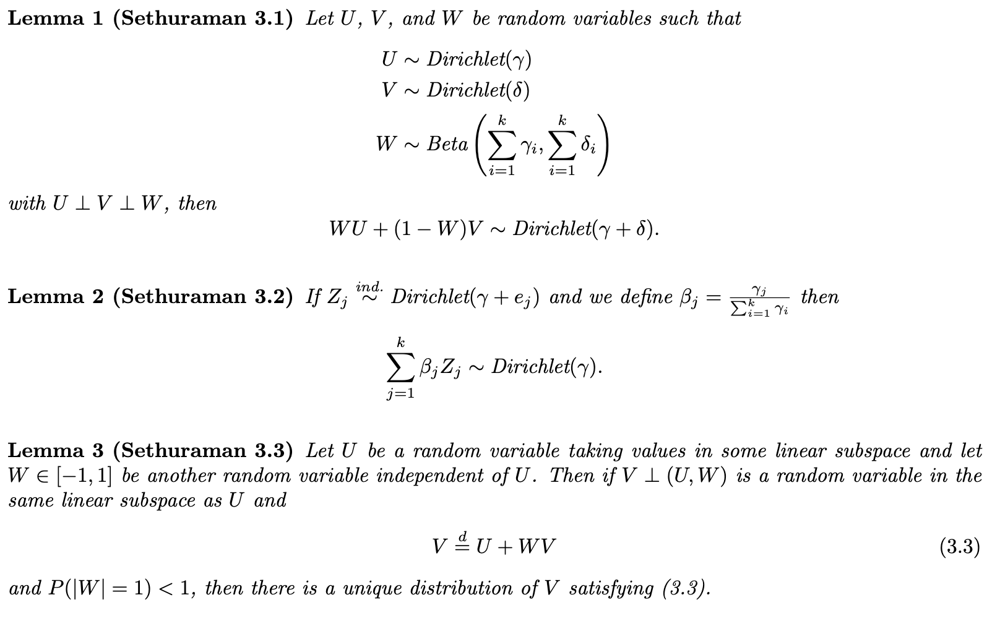
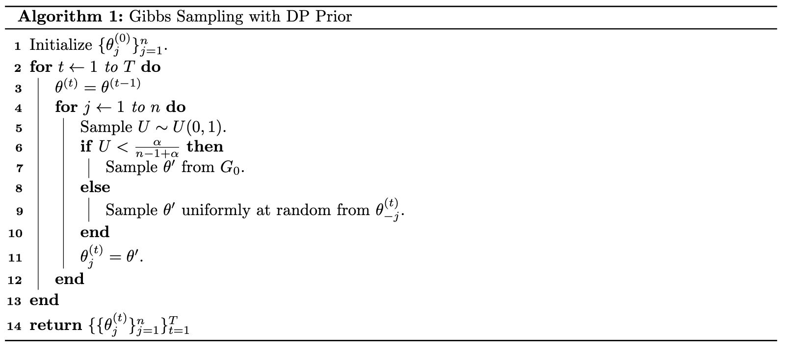
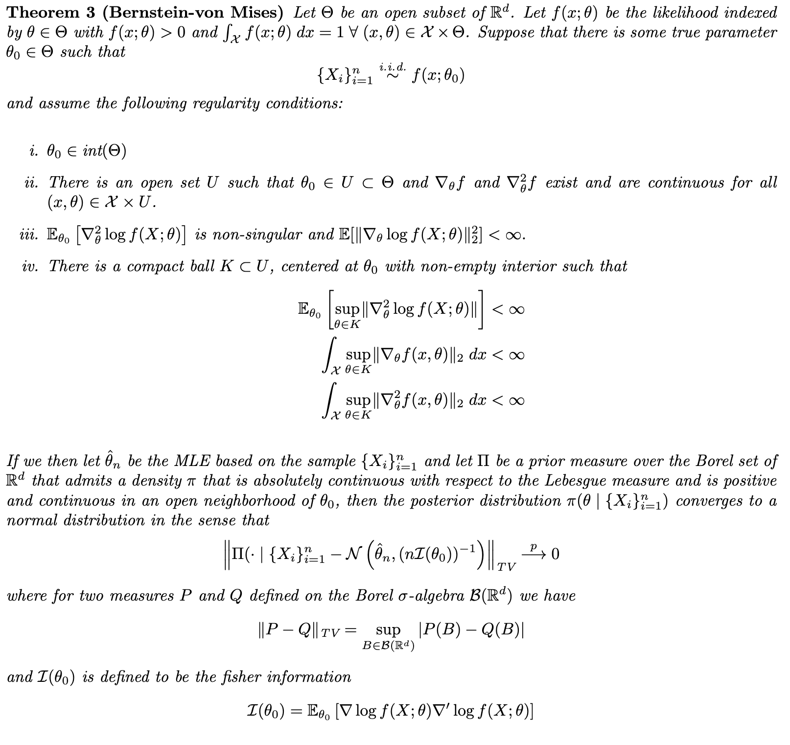
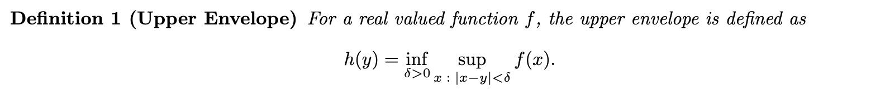
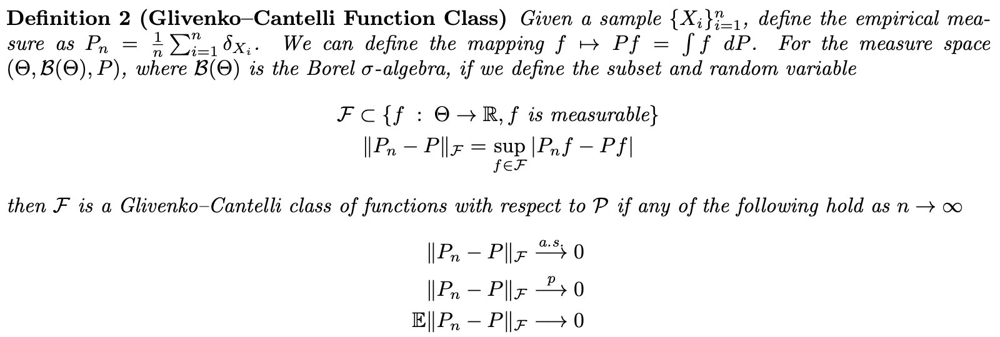
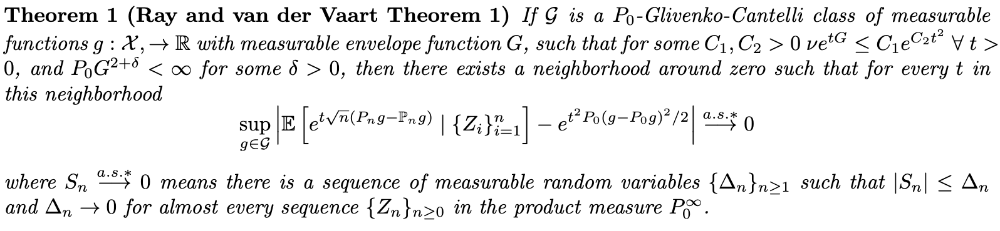
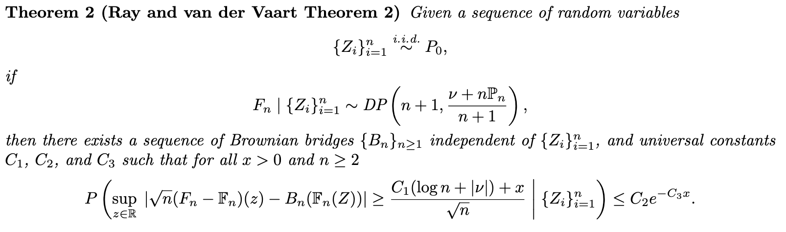
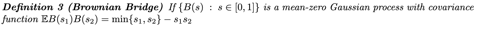
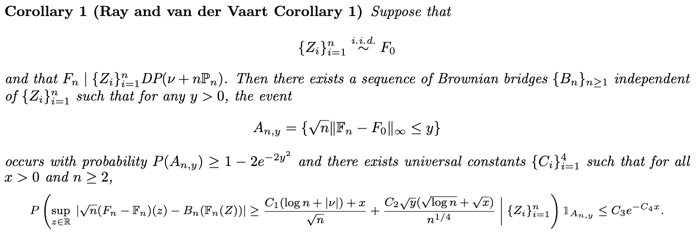

[Back to Main Site](https://davis-berlind.github.io/)

## 1 Introduction

Model selection is a common issue faced when performing Bayesian statistical inference. Given data $\mathcal{D}$ and a model $\mathcal{M} = \{p(\mathcal{D} \;|\; \theta) \;:\; \theta \in \Theta\}$, the common approach is to select a model that maximizes the evidence $$p(\mathcal{D} \;|\; \mathcal{M}) = \int_\Theta p(\mathcal{D} \;|\; \theta, \mathcal{M}) p(\theta\;|\; \mathcal{M}) \;d\theta.$$ Often calculating the evidence is an intractable problem and we have to approximate this quantity with the BIC or by some other method. Estimating the evidence only becomes more difficult as the dimension of $\theta$ increases. For instance, consider the $K$-dimensional mixture model where we observe $X$ and model the latent class labels $Z$,
\begin{align*}
    X_i \;|\; Z_i = j &\overset{\text{i.i.d.}}{\sim} p(x_i;\theta_j) \\
    Z_i &\overset{\text{i.i.d.}}{\sim} \text{MN}(1,\lambda) \\
    \lambda &\sim \text{Dirichlet}(\alpha) \\
    \theta_j &\sim \pi(\theta_j)
\end{align*}
Then the evidence is given by 
$$\prod_{i=1}^n \sum_{z_i=1}^K \int_\Lambda\int_\Theta p(x_i ; \theta_{z_i})\pi(\theta_{z_i}) p(z_i \;|\; \lambda)p(\lambda\;|\;\alpha)\; d\theta_{z_i}d\lambda$$ which rapidly becomes unmanageable as $K \to \infty$. An alternative approach called Bayesian model averaging seeks to circumvent the problem of model selection all together by placing a prior over $\mathcal{M}$ averaging the evidence over $\mathcal{M}$. The difficulty becomes finding a suitable class of priors for $\mathcal{M}$ when the dimension of the parameter indexing $\mathcal{M}$ is unbounded (e.g. when $K \to \infty$ in the case of the mixture model). 

One such family of priors is the Dirichlet Process (DP). The DP was first formally introduced by @ferguson. Shortly thereafter, @AntoniakCharlesE.1974MoDP showed that the DP can be used as prior distribution over the distributions in a mixture of distributions. @west95 introduced and @neal00 summarized the tractable MCMC sampling properties of DP mixture models, and since then the DP has become a popular modeling choice for Bayesian nonparametric problems, having found applications in causal inference @Ray_2020, record linkage @steorts2018generalized, and community detection @DBLP:journals/corr/abs-1904-05330.

## 2 Dirichlet Process Priors

Following the exposition in @Teh2010, consider some measurable space $(\Theta, \mathcal{F}, G_0)$ and let $\{A_i\}_{i=1}^r$ be an arbitrary finite measurable partition of $\Theta$. Then for another measure on this space $G$, we say that $G$ is distributed according to a DP if for some $\alpha > 0$ we have $$\{G(A_i)\}_{i=1}^r \sim \text{Dirichlet}(\alpha G_0(A_1), \ldots, G_0(A_r)).$$ Note that for some measurable $A \subset \mathcal{F}$ we have 
\begin{align*}
    (G(A), G(A^c)) \sim \text{Dirichlet}(\alpha G_0(A), \alpha G_0(A^c)) 
\end{align*}
and thus
\begin{align*}
    \E_{\alpha,G_0}[G(A)] &= \frac{\alpha G_0(A)}{\alpha G_0(A) + \alpha G_0(A^c)} = G_0(A) \tag{$G_0(A) + G_0(A^c) = 1$} \\
    \Var_{\alpha,G_0}(G(A)) &= \frac{\frac{\alpha G_0(A)}{\alpha G_0(A) + \alpha G_0(A^c)}\left(1- \frac{\alpha G_0(A)}{\alpha G_0(A) + \alpha G_0(A^c)}\right)}{1 + \alpha G_0(A) + \alpha G_0(A^c)} = \frac{G_0(A)[1 - G_0(A)]}{1 + \alpha}.
\end{align*}
So $G_0$, can be thought of as the mean distribution and $\alpha$ controls the strength of concentration around this mean with $G(A) \overset{L_2}{\longrightarrow} G_0(A)$ for any measurable set $A$ as $\alpha \to \infty$.

### 2.1 Existence

Theorem 3.4 in @Sethuraman uses a constructive proof to show the existence of DPs using a "stick-breaking" argument. Consider the following model
\begin{align*}
    \beta_k &\overset{i.i.d.}{\sim} \text{Beta}(1,\alpha) \\
    \lambda_k &= \beta_k\prod_{\ell=1}^{k-1} (1-\beta_\ell) \\
    \theta_k &\overset{i.i.d.}{\sim} G_0
\end{align*}
with $\beta_k \perp \theta_j \sforall j,k$. Then if we define
\begin{equation}
    G(A) = \sum_{k=1}^\infty \lambda_k \delta_{\theta_k}(A) \tag{1}
\end{equation}
then $G \sim \text{DP}(\alpha, G_0).$ In other words, for a measurable space $(\Theta, \mathcal{F}, G_0)$, if we define $G$ as in (1), then for any finite partition $\{A_i\}_{i=1}^r$ of $\mathcal{F}$, we have $$\{G(A_i)\}_{i=1}^r \sim \text{Dirichlet}(\alpha G_0(A_1), \ldots, \alpha G_0(A_r).$$ @Sethuraman uses the following lemmas to prove this result

For the proof of Theorem 3.4, @Sethuraman defines 
\begin{align*}
    \widetilde{\beta}_k = \beta_{k+1},\;\sforall k \geq 1 \\
    \widetilde{\theta}_k = \beta_{k+1},\;\sforall k \geq 1 \\
    \widetilde{\lambda}_k = \lambda_{k+1},\;\sforall k \geq 1.
\end{align*}
Then we have
\begin{align*}
    G(A) &= \sum_{k=1}^\infty \lambda_k \delta_{\theta_k}(A) \\
    &= \beta_1 \delta_{\theta_1}(A) + \sum_{k=2}^\infty \beta_k\prod_{\ell=1}^{k-1} (1-\beta_\ell)  \delta_{\theta_k}(A) \\
    &= \beta_1 \delta_{\theta_1}(A) + (1-\beta_1)\sum_{k=2}^\infty \beta_k\prod_{\ell=2}^{k-1} (1-\beta_\ell)  \delta_{\theta_k}(A) \\
    &= \beta_1 \delta_{\theta_1}(A) + (1-\beta_1)\sum_{k=1}^\infty \beta_{k+1}\prod_{\ell=1}^{k-1} (1-\beta_{\ell+1})  \delta_{\theta_{k+1}}(A) \\
    &= \beta_1 \delta_{\theta_1}(A) + (1-\beta_1)\sum_{k=1}^\infty \widetilde{\beta}_k\prod_{\ell=1}^{k-1} (1-\widetilde{\beta}_\ell)  \delta_{\widetilde{\theta}_k}(A) \\
    &= \beta_1 \delta_{\theta_1}(A) + (1-\beta_1)\sum_{k=1}^\infty \widetilde{\lambda}_k \delta_{\widetilde{\theta}_k}(A) \\
    &= \beta_1 \delta_{\theta_1}(A) + (1-\beta_1) \widetilde{G}(A)
\end{align*}
By construction $G \overset{d}{=} \widetilde{G}$, so we can write $G(A) \overset{d}{=} \beta_1 \delta_{\theta_1}(A) + (1-\beta_1) G(A)$. Applying this relation elementwise to the partition $\{A_i\}_{i=1}^r$, we get 
\begin{equation}
    \mathbf{G}(\mathbf{A}) = \beta_1\mathbf{D}(\mathbf{A}) + (1 - \beta_1)\mathbf{G}(\mathbf{A}) \tag{2}
\end{equation}
where 
\begin{align*}
    \mathbf{G}(\mathbf{A}) = \{G(A_i)\}_{i=1}^r \\
    \mathbf{D}(\mathbf{A}) = \{\delta_{\theta_1}(A_i)\}_{i=1}^r
\end{align*}
Note that neither $\theta_1$ nor $\beta_1$ appear in $\widetilde{G}$ as it is defined above, so by the mutual independence assumptions $\beta_1 \perp \mathbf{D} \perp \mathbf{G}$. Suppose for the moment that $\mathbf{P}_{\{\alpha G_0(A_i)\}_{i=1}^r}$ is the $r$-dimensional Dirichlet measure corresponding to $G \sim \text{Dirichlet}(\{\alpha G_0(A_i)\}_{i=1}^r)$. Note that if we are given that $\mathbf{D} = \mathbf{e}_i$, then $\mathbf{D} = \mathbf{P}_{\mathbf{e}_i}$ (the Dirichlet measure puts all the mass on $\mathbf{e}_i$). We can write
\begin{align*}
    \beta_1 \mathbf{D} + (1-\beta_1)\mathbf{G} &\overset{d}{=} \beta_1 \mathbf{P}_{\mathbf{e}_i} + (1-\beta_1)\mathbf{P}_{\{ \alpha G_0(A_i)\}_{i=1}^r} \\
    &\overset{d}{=} \mathbf{P}_{\{ \alpha G_0(A_i)\}_{i=1}^r + \mathbf{e}_i} \tag{$\beta_1 \perp \mathbf{D} \perp \mathbf{G}$ and Lemma 1}
\end{align*}
Multiplying both sides by weights $G_0(A_i)$, and summing over each $\mathbf{e}_i$, we have 
\begin{align*}
    \beta_1 \mathbf{D} + (1-\beta_1)\mathbf{G} &\overset{d}{=} \sum_{i}^r G_0(A_i)[\mathbf{P}_{\{ \alpha G_0(A_i)\}_{i=1}^r + \mathbf{e}_i}] \\
    &= \mathbf{P}_{\{ \alpha G(A_i)\}_{i=1}^r}. \tag{Lemma 2} \\
    &= \mathbf{G}
\end{align*}
Thus $G \sim \text{Dirichlet}(\{\alpha G_0(A_i)\}_{i=1}^r)$ does in fact satisfy (2), and since $G \perp (\theta_1, \beta_1)$, by Lemma 3 it is the unique distribution that does so.

### 2.2 Conjugacy

A convenient property of DP's is that they form a conjugate class. To see this, suppose that $G \sim \text{DP}(\alpha, G_0)$ and that we have $\{\theta_j\}_{j=1}^n \overset{\text{i.i.d.}}{\sim} G$. Then for a given partition $\{A_i\}_{i=1}^r$, since 
\begin{align*}
    \{\mathbf{1}\{\theta_j \in A_i\}\}_{i=1}^r \;|\; G &\overset{\text{i.i.d.}}{\sim} \text{MN}(1,\{G(A_i)\}_{i=1}^r) \\ 
    \{G(A_i)\}_{i=1}^r &\sim \text{Dirichlet}(\{\alpha G_0(A_i)\}_{i=1}^r))
\end{align*}
by the conjugacy of the multinomial and Dirichlet distributions, we have
\begin{align*}
    \{G(A_i)\}_{i=1}^r \;|\; \{\theta_j\}_{j=1}^n  &\sim \text{Dirichlet}(\alpha G_0(A_1) + n_1, \ldots, \alpha G_0(A_r)+n_r) \\
    n_i &= \#\{j \;:\; \theta_j \in A_i\}
\end{align*}
But since we can write $n_i = \sum_{j=1}^n \delta_{\theta_j}(A_i),$ then we can factor out $\alpha + n$ from the posterior parameters to get 
\begin{align*}
    G \;|\; \{\theta_j\}_{j=1}^n  &\sim \text{DP}\left(\alpha + n, \frac{\alpha G_0 + \sum_{j=1}^n \delta_{\theta_j}}{\alpha + n}\right) 
\end{align*}
i.e. the posterior distribution of $G$ is also a DP.

### 2.3 MCMC Sampling

Suppose that we draw $G \sim \text{DP}(\alpha,G_0)$ and $\{\theta_j\}_{j=1}^n \;|\; G \overset{\text{i.i.d.}}{\sim} G$. Then for some measurable $A \subset \Theta$, since $\theta_{n+1} \;|\; G, \{\theta_j\}_{j=1}^n \sim G$, we can write the posterior predictive distribution as 
\begin{align*}
    P(\theta_{n+1} \in A \;|\; \{\theta_j\}_{j=1}^n) &= \E[G(A)\;|\; \{\theta_j\}_{j=1}^n] \\
    &= \frac{\alpha G_0(A) + \sum_{j=1}^n \delta_{\theta_j}(A)}{\alpha + n} 
\end{align*}
where the last line follows from the fact that $\E[G(A)] = G_0(A)$ and the previous derivation of the posterior base distribution. In other words $\theta_{n+1} \;|\; \{\theta_j\}_{j=1}^n$ is distributed according to a mixture model of the empirical distribution and the base distribution $G_0$. This leads to the following convenient Gibbs sampling scheme for updating $\{\theta_j\}_{j=1}^n$.

@neal00 and @west95 both show how to adapt this sampling scheme to the general hierarchical model
\begin{align*}
    X_i \;|\; \theta_i &\overset{\text{i.i.d.}}{\sim} f(x;\theta) \\
    \theta_i \;|\; G &\overset{\text{i.i.d.}}{\sim} G \\
    G &\sim \text{DP}(\alpha, G_0)
\end{align*}
In this setting,
\begin{align*}
    \theta_i \;|\; X_i, \{(X_j,\theta_j)\}_{j \neq i} &\sim r_i G_i + \sum_{j\neq i} q_{ij}\delta_{\theta_j} \\
    r_i &= C \alpha \int f(x_i;\theta) \;dG_0(\theta) \\
    q_{ij} &= C f(x_i;\theta_j)
\end{align*}
Where $G_i$ is the posterior distribution of $\theta_i$ conditional on the single observation $X_i$, and $C$ is a constant such that $r_i + \sum_{j\neq i} q_{ij} = 1$. 

## 3 Discussion of Ray and van der Vaart (2021)

@ray2021 use methods from high-dimensional statistics, specifically results concerning the sub-Gaussian tail behavior of enveloping functions, to establish a Bernstein-von Mises type theorem for Dirichlet processes. This is a powerful result, as it shows that even posterior distributions derived with Bayesian nonparametric assumptions will behave like normal random variables asymptotically. @ray2021 consider the setting where $(\mathcal{X}, \mathcal{A}, \nu)$ is a generic measure space and we have the following hierarchical model,
\begin{align*}
    \{Z_i\}_{i=1}^n \;|\; P_0 &\overset{\text{i.i.d.}}{\sim} P_0 \\
    P_0 &\sim \text{DP}(1, \nu).
\end{align*}
If we define $\mathbb{P}_n = \frac{1}{n} \sum_{i=1}^n \delta_{Z_i}$ to be the empirical distribution of the sample $\{Z_i\}_{i=1}^n$, and let $P_n$ be a draw from the posterior DP, then we have $$P_n \;|\; \{Z_i\}_{i=1}^n \sim \text{DP} \left(n+1, \frac{\nu + n \mathbb{P}_n}{n+1}\right).$$ We will make use of these distributions as we explore the results of @ray2021.

### 3.1 Bernstein-von Mises Theorem

The Bernstein-von Mises theorem[^1] establishes the convergence of posterior distributions to the normal distribution in the Bayesian setting. The following formulation of the theorem comes from the lecture notes of Richard Nickl.[^2]

This powerful theorem states that as $n\to\infty$, any Bayesian inference (subject to regularity conditions) is asymptotically correct in the frequentist view, regardless of the choice of prior.

### 3.2 Ray and van der Vaart (2021) Theorem 1

@ray2021 are able to show that under certain regularity conditions, the posterior distribution $P_n$ converges in a sense to a normal distribution. This result is similar to a version of the Bernstein-von Mises theorem, which states that posterior distributions in Bayesian inference are asymptotically normal. First we define an upper envelope

and the Glivenko-Cantelli class of functions.

Then the formal result is as follows,

Since the function  $t \mapsto e^{t^2\sigma^2/2}$ is the MGF of a normal distribution with mean 0 and variance $\sigma^2$, the interpretation of Theorem 1 is that the MGF of posterior Dirichlet process centered at the empirical measure is converged to the centered normal distribution with variance $P_0(g - P_0g)^2$ in a neighborhood of 0, which implies convergence in distribution. Note that the Glivenko-Cantelli class of functions referred to in Theorem 1 have the property that the empirical CDF converges uniformly to the population CDF.

Below is a partial recreation of the proof of Theorem 1:

By Theorem 14.37 in @ghosal, if 
\begin{align*}
    V_n &\sim \text{Beta}(|\nu|, n) \\ 
    Q &\sim \text{DP}(\nu) \\
    \{W_i\}_{i=1}^n &\overset{\text{i.i.d.}}{\sim} \text{Exp}(1)
\end{align*} 
and $V_n,\perp Q\perp \{W_i\}_{i=1}^n$, then the posterior DP, $P_n$, has the following equivalent characterization
\begin{align}
    P_n = V_n Q g + (1-V_n)\frac{\sum_{i=1}^n W_i g(Z_i)}{\sum_{i=1}^n W_i}.\tag{3}
\end{align}
Next, using (3) we can write
\begin{align*}
    \sqrt{n}(P_n - \mathbb{P}_n g) &= \sqrt{n}\left(V_n Q g + (1-V_n)\frac{\sum_{i=1}^n W_i g(Z_i)}{\sum_{i=1}^n W_i} - \mathbb{P}_n g\right) \\
    &= \sqrt{n}V_n\left(Q g - \frac{\sum_{i=1}^n W_i g(Z_i)}{\sum_{i=1}^n W_i}\right) + \sqrt{n}\left(\frac{\sum_{i=1}^n W_i(g(Z_i) - \mathbb{P}_n g)}{\sum_{i=1}^n W_i}\right) \\
    &= \sqrt{n}V_n\left(Q g - \frac{\sum_{i=1}^n W_i g(Z_i)}{\sum_{i=1}^n W_i}\right) + \sqrt{n}\left(\frac{\sum_{i=1}^n (W_i-1)(g(Z_i) - \mathbb{P}_n g)}{\sum_{i=1}^n W_i}\right) \tag{$\sum_{i=1}^n g(Z_i) = n\mathbb{P}_n g = \sum_{i=1} \delta_{Z_i}g(Z_i)$} \\
    &= \sqrt{n}V_n\left(Q g - \frac{\sum_{i=1}^n W_i g(Z_i)}{\sum_{i=1}^n W_i}\right) + \frac{1}{\overline{W}_n\sqrt{n}}\sum_{i=1}^n (W_i-1)(g(Z_i) - \mathbb{P}_n g). \tag{$\overline{W}_n = n^{-1} \sum_{i=1}^n W_i$}
\end{align*}
Since $g(Z_i) \leq |g(Z_i)| \sforall Z_i$, and 
\begin{align*}
    -\frac{\sum_{i=1}^n W_i g(Z_i)}{\sum_{i=1}^n W_i} &\leq \left|\frac{\sum_{i=1}^n W_i \max_{i \in \{1,\ldots, n\}} \; g(Z_i)}{\sum_{i=1}^n W_i}\right| \\
    &\leq \frac{\sum_{i=1}^n W_i |g(Z_i)|}{\sum_{i=1}^n W_i}\tag{triangle inequality} \\
    &\leq \frac{\sum_{i=1}^n W_i  \max_{j \in \{1,\ldots, n\}} \; |g(Z_j)|}{\sum_{i=1}^n W_i}\tag{$|g(Z_i)| \leq \max_{j \in \{1,\ldots, n\}} \; |g(Z_j)|$} \\
    &= \max_{j \in \{1,\ldots, n\}} \; |g(Z_j)|
\end{align*}
then we have $$Q g - \frac{\sum_{i=1}^n W_i g(Z_i)}{\sum_{i=1}^n W_i} \leq Q|g| + \max_{i \in \{1,\ldots, n\}} \; |g(Z_i)|.$$ We can assume WLOG that $|\nu| = 1$, then since $g$ is in a Glivenko–Cantelli class and $Q \sim \text{DP}(\nu) \implies \nu |g| = \E[Q |g|]$, we have $Q |g| \overset{\text{a.s.}}{\to} \nu |g| < \infty.$ We can also use the fact that $\lim_{n\to\infty} \text{Beta}(1,n) \overset{d}{\longrightarrow} \text{Exp}(1)$, which implies $nV_n \overset{d}{\longrightarrow} \text{Exp}(1).$ Additionally, since $P_0 g^2 < \infty$ by assumption and the $Z_i's$ are i.i.d., by Ray and van der Vaart Lemma 5, we have $$\frac{1}{\sqrt{n}}\max_{i\in\{1\ldots,n\}} |g(Z_i)| \overset{a.s.}{\longrightarrow} 0.$$ So by Slutsky's Theorem 
\begin{align*}
    \sqrt{n}V_n\left(Q g - \frac{\sum_{i=1}^n W_i g(Z_i)}{\sum_{i=1}^n W_i}\right) &= n V_n\left(\frac{1}{\sqrt{n}}Q g - \frac{\sum_{i=1}^n W_i g(Z_i)}{\sqrt{n}\sum_{i=1}^n W_i}\right) \\
    &\leq n V_n \left( \frac{1}{\sqrt{n}}Q|g| +\frac{1}{\sqrt{n}}\max_{i\in\{1\ldots,n\}} |g(Z_i)|\right) \\
    &\overset{d}{\longrightarrow} \text{Exp}(1)\cdot(0 + 0) \\
    &=0
\end{align*}
Similarly, since $\E[W_i] = 1$, the continuous mapping theorem and strong LLN imply $(\overline{W}_n)^{-1} \overset{a.s.}{\longrightarrow} 1$, and again because $g$ is in the Glivenko-Cantelli class, we have $\mathbb{P}_n g \overset{a.s.}{\longrightarrow} P_0 g$ and $\mathbb{P}_n g^w \overset{a.s.}{\longrightarrow} P_0 g^2$, which can be combined with the Lindeberg CLT to show that $$\frac{1}{\sqrt{n}}\sum_{i=1}^n (W_i-1)(g(Z_i) - \mathbb{P}_n g) \overset{d}{\longrightarrow} \mathcal{N}(0, P_0(g-P_0 g)^2).$$ So another application of Slutsky's theorem gives
\begin{align*}
    \sqrt{n}(P_n - \mathbb{P}_n g) &=  \sqrt{n}V_n\left(Q g - \frac{\sum_{i=1}^n W_i g(Z_i)}{\sum_{i=1}^n W_i}\right) + \frac{1}{\overline{W}_n\sqrt{n}}\sum_{i=1}^n (W_i-1)(g(Z_i) - \mathbb{P}_n g) \\
    &\overset{d}{\longrightarrow} 0 + 1 \cdot\mathcal{N}(0, P_0(g-P_0 g)^2) \\
    &=\mathcal{N}(0, P_0(g-P_0 g)^2).
\end{align*}

The remainder of the proof involves showing that the convergence result above holds uniformly for $g$ in a Glivenko-Cantelli class (Ray and van der Vaart Lemma 2), and showing that if this uniform convergence holds, then we also have almost sure convergence of the MGF of $\sqrt{n}(P_n g - \mathbb{P}_n g) \;|\; \{Z_i\}_{i=1}^n$ (Ray and van der Vaart Lemma 3).

### 3.3 Ray and van der Vaart (2021) Theorem 2

The second result proved by @Ray_2020 is a concentration inequality for the posterior CDF of a DP. If we define the CDFs
\begin{align*}
    F_n(t) &= P_n \mathbf{1}_{(-\infty,t]}\\
    \mathbb{F}_n(t) &= \mathbb{P}_n \mathbf{1}_{(-\infty,t]}
\end{align*}
and let $|\nu| = \nu(\mathbb{R})$ ($|\nu|=1$ if $\nu$ is a probability measure), then @Ray_2020 show the following result,

The concentration inequality in Theorem 2 shows that the CDF drawn from a posterior DP can be approximated with an independent sequence of Brownian bridges,

Theorem 2 is used to prove Corollary 1, 

Corollary 1, states that the event that true and empirical distributions of $\{Z_i\}_{i=1}^n$ are "close," happens with high probability, and when they are close, the posterior DP can be approximated with a sequence of Brownian bridges independent of $\{Z_i\}_{i=1}^n$. 

Below is a partial reconstruction of the proof of Theorem 2:

For a mean zero Gaussian process $\{G_t\}_{t\in T}$ with a countable index set $T$, if $\sup_{t\in T} |G_t| < \infty$, then Borell's inequality gives $$P\left(\sup_{t\in T} |G_t|  \geq \E \sup_{t\in T} |G_t|  + x\right)\leq \exp\left[-\frac{x^2}{2\sigma^2}\right], \; \sforall x > 0$$ where $\sigma^2 = \sup_{t\in T} \E G_t^2 < \infty.$ We also have that if $X_\theta \sim \text{Gamma}(\theta,1)$, then $\E[X_\theta] = \theta$, and we have the following sub-exponential concentration inequalities for all $x > 0$,
\begin{align*}
    P(X_\theta > \theta + \sqrt{2\theta x} + x) &\leq e^{-x} \\
    P(X_\theta < \theta - \sqrt{2\theta x}) &\leq e^{-x}.
\end{align*}
Then if we take $\overline{F}(t) \; |\; \{Z_i\}_{i=1}^n  = \overline{P}_n \mathbf{1}_{(-\infty,t]}$ where $\overline{P}_n \sim \text{DP}(n \mathbf{P}_n)$ (i.e. letting $\nu =0$ on all of $\mathbb{R}$). Then using the representation of the DP in (3) where we let $g(Z_i) = \mathbf{1}_{(-\infty,Z_i]}$, we have 
\begin{align*}
    \lVert \sqrt{n} (F - \mathbf{F}_n) - \sqrt{n}(\overline{F} - \mathbb{F}_n)\rVert_\infty &= \lVert \sqrt{n} (F - \overline{F})\rVert_\infty\\
    &= \sup_{t\in \mathbb{R}} \sqrt{n} |(P_n -  \overline{P}_n)\mathbf{1}_{(-\infty,t]}|\\
    &\leq \sqrt{n} V_n
\end{align*}
where again $V_n \sim \text{Beta}(|\nu|,1)$. If $X \sim \text{Gamma}(|\nu|,1)$ and $Y_n \sim \text{Gamma}(n,1)$ and $X \perp Y_n$, then $$V_n \overset{d}{=} \frac{X}{X+Y_n}$$ and the above exponential inequalities for Gamma random variables imply $$P(Y_n < Cn) \leq e^{-x}$$ for $C = 1 -
\sqrt{2/3} > 1/6$ and any $0 < x \leq n/3$. Then we also have that $$P(X/Y_n > 6n^{-1}(|\nu| + \sqrt{2|\nu|x} + x)) \leq 2 e^{-x}$$ for all $0< x \leq n/3$. For $x \geq n/3$ the bound is trivial since $$P(X/(X + Y_n) \geq 6n^{-1}(|\nu| + \sqrt{2|\nu|x} + x)) \leq P(X/(X+Y_n) \geq 2) = 0.$$ Using these inequalities and the fact that $2\sqrt{|\nu|x} \leq |\nu| + x$, we get inequality (2.9)
\begin{align*}
    P(\lVert \sqrt{n}(F- \mathbb{F}_n) - \sqrt{n}(\overline{F}-\mathbb{F}_n)\rVert_\infty \geq 12 n^{-1/2}(|\nu| + x) \;|\; \{Z_i\}_{i=1}^n) \leq 2e^{-x}, \; \sforall x > 0
\end{align*}
The remainder of the proof follows by replacing $\sqrt{n}(\overline{F}-\mathbb{F}_n)$ above with a Brownian bridge $B_n(\mathbb{F}_n)$ and proving the exponential concentration inequality $$P\left(\lVert \sqrt{n}(\overline{F}-\mathbb{F}_n) - B_n(\mathbb{F})_n\rVert_\infty \geq \frac{C_1\log n + x}{\sqrt{n}}\right) \leq C_2 e^{-C_3x}.$$

## References

[^1]: See e.g. https://encyclopediaofmath.org/wiki/Bernstein-von_Mises_theorem.
[^2]: See http://www.statslab.cam.ac.uk/~nickl/Site/__files/stat2013.pdf.
