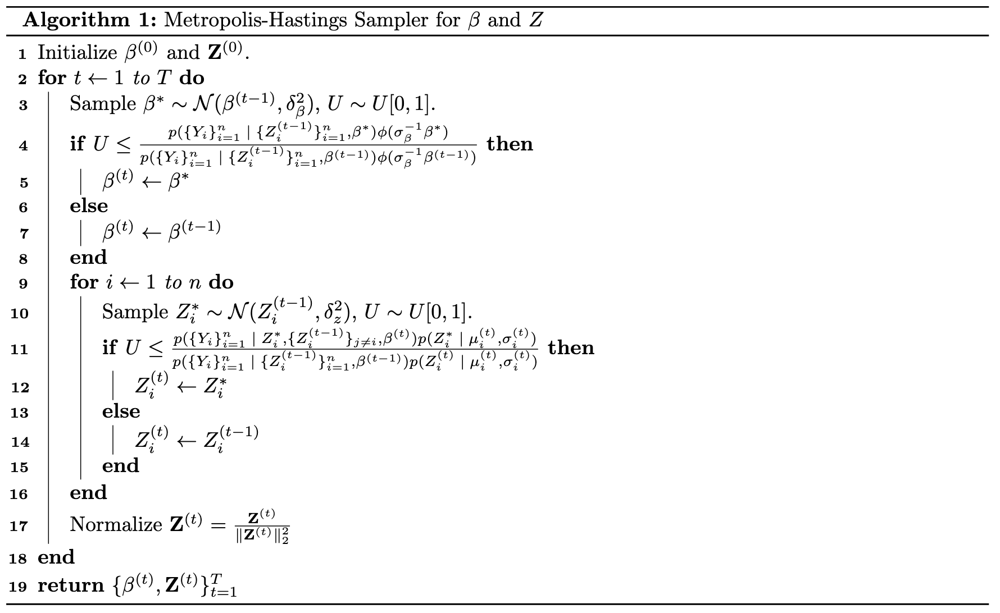
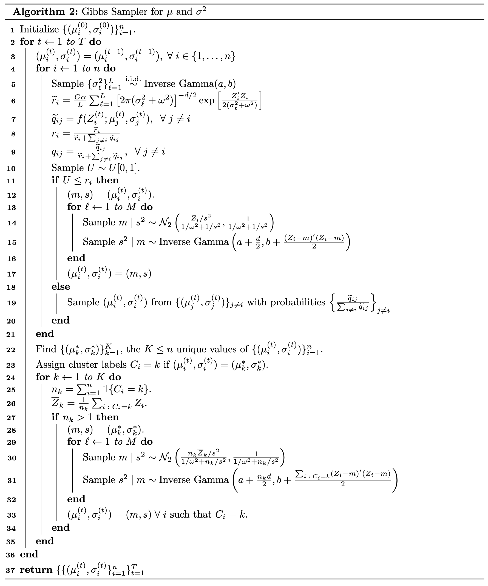
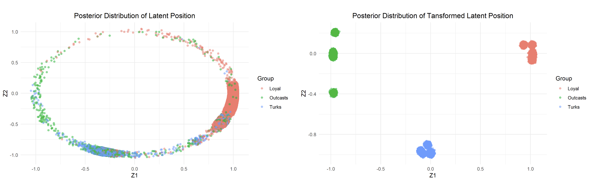
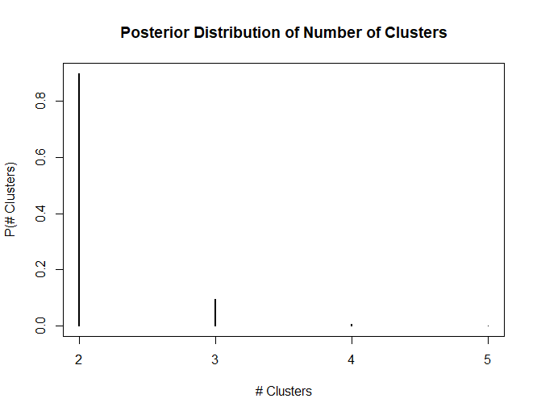
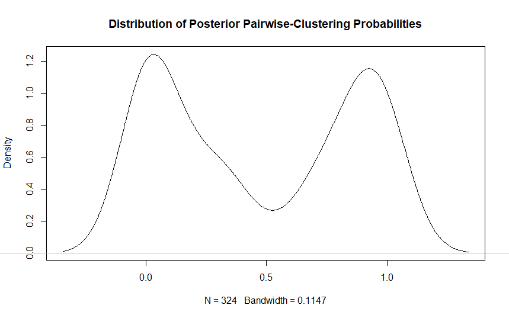
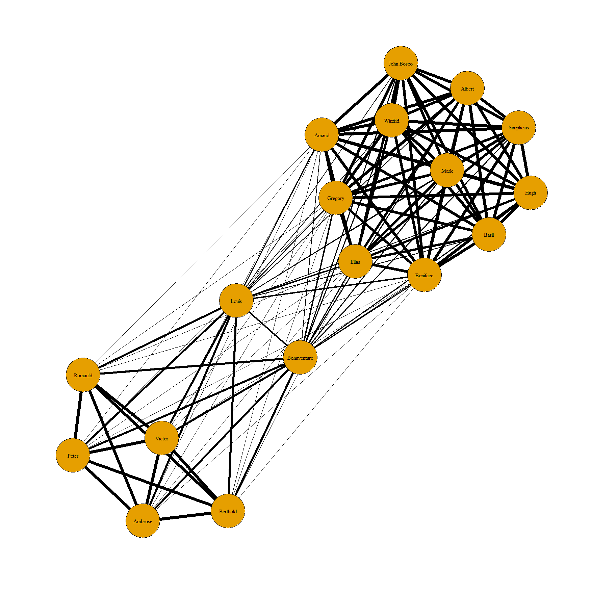

## Background

In his 1968 PhD thesis, @sampson conducted an ethnographic study of novice monks living in a New England monastery. Sampson asked the monks to rank their three most liked and three most disliked peers. This survey was performed on five separate occasions over a year long period. Shortly after the fourth survey was administered, four members of the monastery were expelled. Sampson was interested in identifying the social dynamics that led to the expulsions and used his survey to classify the monks into three categories: Young Turks, Loyal Opposition, Outcasts. In the [data set](https://networkdata.ics.uci.edu/netdata/html/sampson.html), any monk that ranked a colleague in their top three positive relations in any survey was considered to 'like' that monk, resulting in an adjacency matrix $\mathbf{Y}\in\{0,1\}^{18\times 18}$ with $Y_{ij}=1$ indicating a one-way 'liking' relation from monk $i$ to monk $j$. 

@handcock07 developed a latent-position clustering model to detect communities within the network of monks. Their model treats the number of communities as a fixed but unknown parameter and they use the BIC to determine the number of clusters to include in the model. My goal in this post is to lay out a fully Bayesian extension of @handcock07. Rather than treat the number of clusters $K$ as fixed, I will use a Dirichlet process to induce a prior distribtion on $K$.

## Model

Given a graph $\mathcal{G}$, we assume that if nodes $i$ and $j$ are in the same community, they are more likely to be connected by an edge in $\mathcal{G}$. @hoff2002latent generalized this idea to a latent space model for network data. They assume each node has a position $Z_i \in \mathbb{R}^d$ in a $d$-dimensional latent social space. The advantage of using latent positions is that it induces transitivity, so that if node $i$ is close to node $j$ in the latent space, and node $j$ is close to node $k$, then we will also have that node $i$ and $k$ are close therefore more likely to be connected in $\mathcal{G}$. Formally, if we have an adjacency matrix $\mathbf{Y}$, where $Y_{ij} = 1$ if there is (directed) edge going from node $i$ to $j$, and $Y_{ij} = 0$ otherwise, then we have  
\begin{gather*}
    p(\mathbf{Y} \;|\; \mathbf{Z}, \beta) = \prod_{i \neq j} p(Y_{ij} \;|\; Z_i, Z_j), \\
    Y_{ij} \;|\; Z_i, Z_j, \beta \overset{\text{ind.}}{\sim} \text{Bernoulli}(\pi_{ij}), \\ 
    \pi_{ij} = \text{Logistic}(\beta - \lVert Z_i - Z_j \rVert_2).
\end{gather*}
@handcock07 showed that it is possible to include edge specific covariates, $X_{ij}$. For simplicity, I just choose to include an intercept $\beta$, and focus on modeling the latent positions, $\mathbf{Z}$.

### Dirchlet Process Prior

To model the latent social space, @handcock07 fixed some $K \in \mathbb{N}$ and adopted a Gaussian mixture model,
\begin{align*}
    X_{ik} &\overset{\text{ind.}}{\sim} \mathcal{N}_d(\mu_k, \sigma_k^2 \mathbf{I}_d), \\
    Z_i &= \sum_{k=1}^K \lambda_k X_{ik}, \\
    \lambda &\sim \text{Dirichlet}(\nu).
\end{align*}
@handcock07 fix the number of clusters *a priori* and find the $K$ that maximizes integrated likelihood (approximated by the BIC). We can circumvent this model selection problem with a Bayesian nonparametric approach. Note that a $K$ cluster mixture model is just a $K+1$ mixture model with the restriction that $\lambda_{k+1} = 0$. In this sense, every size $K' < K$ mixture model is embedded in the $K$ cluster mixture model. If we let $K \to \infty$ and can find a suitable prior for $\{\lambda_k\}_{k\geq 1}$, then our model will account for every possible configuration of $K$. Then, by treating the number of mixture components as a random variable, we can correctly make probabilistic statements about the number of clusters, including finding the *a posteriori* most likely number of clusters.

To implement an infinite mixture model, we can adopt a Dirichlet process (DP) prior for the distribution that generates the latent positions $Z_i$. The Dirichlet process is a distribution over distributions that was first formalized by @ferguson. @AntoniakCharlesE.1974MoDP showed the DP can be used as prior over distributions in mixture models. Formally, let $(\Theta, \mathcal{F}, G_0)$ be some measurable space and let $\{A_i\}_{i=1}^r$ be a finite measurable partition of $\Theta$. Then for another measure on this space $G$, we say that $G \sim \text{DP}(\alpha, G_0)$ if for some $\alpha > 0$ we have $$\{G(A_i)\}_{i=1}^r \sim \text{Dirichlet}(\{G_0(A_i)\}_{i=1}^r).$$ Note that for some measurable $A \subset \mathcal{F}$ we have 
\begin{align*}
    (G(A), G(A^c)) \sim \text{Dirichlet}(\alpha G_0(A), \alpha G_0(A^c)), 
\end{align*}
and thus
\begin{align*}
    \E_{\alpha,G_0}[G(A)] &= \frac{\alpha G_0(A)}{\alpha G_0(A) + \alpha G_0(A^c)} = G_0(A) \tag{$G_0(A) + G_0(A^c) = 1$} \\
    \Var_{\alpha,G_0}(G(A)) &= \frac{G_0(A)[1 - G_0(A)]}{1 + \alpha}.
\end{align*}
So $G_0$, can be thought of as the mean distribution and $\alpha$ controls the strength of concentration around this mean with $G(A) \overset{L_2}{\longrightarrow} G_0(A)$ for any measurable set $A$ as $\alpha \to \infty$. Rewriting the model of @handcock07 to include a DP prior, we have
\begin{align*}
    Z_{i} \;|\; \mu_i, \sigma_i^2 &\sim \mathcal{N}_d(\mu_i, \sigma_i^2\mathbf{I}_d), \\
    (\mu_i, \sigma_i) \;|\; G &\sim G, \\
    G &\sim \text{DP}(\alpha, \mathcal{N}_d(0,\omega^2\mathbf{I}_d) \times \text{Inverse Gamma}(a,b)).
\end{align*}
We can adopt the same prior assumptions as @handcock07 by letting $a = 1$, $b = 0.103 / 2$, and $\omega^2 = 2$. 

### Sampling Methodology

#### Sampling $\beta$ and $\mathbf{Z}$

To update the intercept parameter $\beta$ and the latent positions $\mathbf{Z}$, we use the same Metropolis-Hastings sampling scheme specified in @handcock07 and described in Algorithm 1.



#### Sampling $\mu_i$ and $\sigma_i^2$

Slightly more care is needed to sample $\mu_i$ and $\sigma_i^2$. The advantage of DP priors is that they are very tractable in the context of MCMC sampling. @west95 showed that if we have a general hierarchical model of the form 
\begin{align*}
    Z_i \;|\; \theta_i &\sim f(z;\theta), \\
    \theta_i \;|\; G &\sim G, \\
    G &\sim \text{DP}(\alpha, G_0),
\end{align*}
then 
\begin{align} 
    \theta_i \;|\; Z_i, \{(Z_j,\theta_j)\}_{j \neq i} &\sim r_i p(\mu_i , \sigma^2_i\;|\; Z_i) + \sum_{j\neq i} q_{ij}\delta_{\theta_j}, \label{eq:dirpost}\\
    r_i &= C \alpha \int f(z_i;\theta) \;dG_0(\theta), \notag \\
    q_{ij} &= C f(z_i;\theta_j), \notag
\end{align}
where $C$ is a constant such that $r_i + \sum_{j\neq i} q_{ij} = 1$. In the context of our model, we have $\theta_i = (\mu_i,\sigma_i^2)$, $f$ is a $d$-dimensional normal density with mean $\mu_i$ and variance-covariance $\sigma_i^2 \mathbf{I}_d$, and $G_0= \mathcal{N}_d(0,2\mathbf{I}_d) \times 0.103\chi^{-2}_2$. We can update $(\mu_i,\sigma_i^2)$ with a Gibbs step that either samples an existing value from $\{(\mu_i,\sigma_i^2)\}_{j\neq i}$, or draws a new $(\mu_i,\sigma_i^2)$ from the posterior distribution conditional on the single observation $Z_i$. Then, after updating $(\mu_i,\sigma_i^2)$ for each $i$, we can assign cluster labels by grouping the nodes that have the same values for $(\mu_i,\sigma_i^2)$, and within those clusters we can update $(\mu_i,\sigma_i^2)$ with yet another Gibbs iteration from the full conditional distribution given all the $Z_i$'s in the cluster. Note that we do not have a closed form for the posterior distribution of $(\mu_i, \sigma_i^2)$, but we can simulate draws from the posterior by implementing a Gibbs-within-Gibbs algorithm that takes $M$ draws from the full-conditional distributions of $\mu_i$ and $\sigma_i^2$ and keeps the last sample as the updated $(\mu_i, \sigma_i^2)$.\footnote{We could have chosen $G_0$ to be a Normal-Gamma$(\mu_0,\lambda,a,b)$ distribution, then we would have had conjugacy between $G_0$ and the likelihood of $Z_i$, but this model introduces an additional precision parameter $\lambda$. There is no straightforward interpretation of $\lambda$ in the original framework of @handcock07, and after some experimentation, I saw the the choice of $\lambda$ heavily influenced our results, so I chose to go forgo conjugacy in favor of the model presented.} Another nuance of our approach is that the integrated likelihood is equal to
\begin{align*}
    \int f(z_i;\theta) \;dG_0(\theta) &= \int_{0}^\infty\int_{-\infty}^\infty ((2\pi)^2 \sigma^2\omega^2)^{-d/2}\exp\left[-\frac{(z-\mu)'(z-\mu)}{2\sigma^2}-\frac{\mu'\mu}{2\omega^2}-\frac{b}{\sigma^2}\right] \frac{b^a}{\Gamma(a)}(\sigma^2)^{-a-1}\;d\mu\; d\sigma^2 \\
    &= \int_0^\infty \left[2\pi(\sigma^2 + \omega^2 \right)]^{-d/2}\exp\left[\frac{Z'_iZ_i}{2(\sigma^2 + \omega^2)}\right] \frac{b^a}{\Gamma(a)} (\sigma^2)^{-a-1} \exp\left[-\frac{b}{\sigma^2}\right]\;d\sigma^2,
\end{align*}
which cannot be directly calculated. However, since $\sigma^2 \sim \text{Inverse Gamma}(a,b)$, then we have
\begin{align*}
    &\E_{\sigma^2}\left[\left[2\pi(\sigma^2 + \omega^2 \right)]^{-d/2}\exp\left[\frac{Z'_iZ_i}{2(\sigma^2 + \omega^2)}\right] \right] \\
    &\quad = \int_0^\infty \left[2\pi(\sigma^2 + \omega^2 \right)]^{-d/2}\exp\left[\frac{Z'_iZ_i}{2(\sigma^2 + \omega^2)}\right] \frac{b^a}{\Gamma(a)} (\sigma^2)^{-a-1} \exp\left[-\frac{b}{\sigma^2}\right]\;d\sigma^2.
\end{align*}
So we can use importance sampling to approximate the integrated likelihood conditional on $Z_i$ by sampling $\{\sigma_{\ell}^2\}_{\ell=1}^L \overset{\text{i.i.d.}}{\sim} \text{Inverse Gamma}(a,b)$ and calculating $$\hat{r}_i = \frac{C\alpha}{L}\sum_{\ell=1}^L \left[2\pi(\sigma_{\ell}^2 + \omega^2 )\right]^{-d/2}\exp\left[\frac{Z'_iZ_i}{2(\sigma_{\ell}^2 + \omega^2)}\right] $$

This methodology is summarized in Algorithm 2.



#### Initialization and Post-Processing

As first noted in @hoff2002latent, the likelihood in this model is invariant to reflections, rotations and translations of the latent positions $Z_i$. We take the same post-processing approach as @hoff2002latent to account for this basic non-identifiablity in the model. We find the MLE of our model $\hat{Z}_{\text{MLE}}$, and take a Procrustes transformation of the sampled posterior latent positions with respect to $\hat{Z}_{\text{MLE}}$.

## Implementation

We now write a Gibbs sampler to implement our model. First we define helper functions to calculate the Dirichlet process sampling probabilities, initialize the sampler, and perform the necessary post processing laid out above.

```{r, eval=FALSE}
# helper function for calculating integrated likelihood
intlik <- function(x, tau, omega) {
  vr <- (tau + omega) / (tau * omega)
  d <- length(x)
  prod(dnorm(x^2, sd = sqrt(vr)))
}

# Dirichlet process sampling probabilities
dp_probs <- function(z, d, n, mu, sigma, dp_param, a, b, omega) {
  probs <- rep(1, n) 
  for (i in 1:d) {
    probs[1:(n-1)] <- probs[1:(n-1)] * mapply(function(mu, sigma) dnorm(z[i], mean = mu, sd = sqrt(sigma)), mu[,i], sigma)
  }
  tau <- rgamma(500, shape = a, rate = b)
  probs[n] <- probs[n] * dp_param * mean(sapply(tau, intlik, x = z, omega))
  probs <- probs / sum(probs)
  return(probs)
}

# negative loglike of graph given Z; to be used by optim to find mle starting positions
# minimize negative loglike = maximize loglike
# this likelihood is given by eqn (4) in Hoff 2002
log_lik <- function(alpha, z, adj){
  num <- adj * (alpha - as.matrix(dist(z)))
  denom <- log(1 + exp(alpha - as.matrix(dist(z))))
  diag(denom) <- 0
  return(sum(num - denom))
}

mlpY <- function(par, d, n, adj) {
  alpha <- par[1]
  z <- matrix(par[d*n], nrow = n, ncol = d)
  return(-log_lik(alpha, z, adj))
}

# Procrustes transform; Z0 is target, Z is matrix to be transformed
# solution is given by (Z0 Z^T) (Z Z0^T Z0 Z^T)^-1/2 Z
proc.crr <- function(z_chain, Z0){
  d <- length(z_chain)
  n <- nrow(z_chain[[1]])
  for (i in 1:n) {
    z <- sapply(1:d, function(i) z_chain[[i]][i,])
    z <- z + rep(1, nrow(z)) %*% t(apply(Z0, 2, mean) - apply(z, 2, mean))
    A <- t(z) %*% (Z0 %*% t(Z0)) %*% z
    eA <- eigen(A, symmetric = TRUE)
    sqrtA <- eA$vec[,1:d] %*% diag(sqrt(eA$val[1:d])) %*% t(eA$vec[,1:d])
    zp <- t(t(Z0) %*% z %*% solve(sqrtA) %*% t(z))
    for (j in 1:d) {
      z_chain[[j]][i,] <- zp[,j]
    }
  }
  return(z_chain)
}
```

We now are ready to load the data and run our Gibbs sampler. Given that we have $n=18$ monks in the data set, I choose $\alpha = 7$ for our Dirichlet process prior. This choice implies a prior mean number of clusters equal to 9.3 and a prior variance of 3.8. Using a normal approximation, this choice of $\alpha$ gives us decent coverage over the entire range of possible $K \in \{1, \ldots, 18\}$, and places a suitable degree of prior density on 3, the number of clusters Sampson estimated. I run the sampling algorithm for 110,000 total iterations, using $M = 5$ Gibbs-within-Gibbs iterations as described in Algorithm 2. I then thin the chains by throwing out the first 10,000 iterations as burn-in and only keeping every tenth sample, leaving us with 10,000 posterior samples. The trace plot (not pictured) of the intercept indicates that the sampler converges and that we have reasonably low auto-correlation for these parameter choices.

```{r, eval = FALSE}
library(ergm)
data(sampson)

adj <- as.matrix(samplike, matrix.type = "adjacency")
group <- get.vertex.attribute(samplike, "group")
monks <- get.vertex.attribute(samplike, "vertex.names")

d <- 2                                            # latent dimension
n <- nrow(adj)                                    # number of nodes
gibbs_iter <- 101000                              # number of gibbs iterations
burnin <- 10000                                   # number of burn-in iterations
thin <- 10                                        # thinning interval
thindex <- seq(burnin + 1, gibbs_iter, by = thin)

diter <- 5 # number of Gibbs-within-Gibbs iterations

beta_prior_mean <- 0      # prior mean of intercept 
beta_prior_sd <- sqrt(2)  # prior sd of intercept
beta_prop_sd <- 0.5       # intercept proposal sd

z_prop_sd <- 0.2           # position proposal sd

# dirichlet prior precision
dp_param <- 10
# prior cluster size
dp_param * (digamma(dp_param + n) - digamma(dp_param))
# prior cluster variance
dp_param * (digamma(dp_param + n) - digamma(dp_param)) + dp_param^2 * (trigamma(dp_param + n) - trigamma(dp_param))

# sigma prior
a <- 1   
b <- 0.5 * .103 

# mu prior
mu_prior_var <- 2

# initialize z with MLE
z_chain <- lapply(1:d, function(x) matrix(nrow = gibbs_iter, ncol = n))
z <- cbind(ifelse(group == "Outcasts", -1, 1), 0)
z[group != "Outcasts" & group != "Loyal",1] <- 0
z[group != "Outcasts" & group != "Loyal",2] <- -1
z <- z / sapply(1:d, function(d) sqrt(apply(z^2,1,sum))) # normalize to have unit norm
mle <- optim(c(-1, z), mlpY, d = d, n = n, adj = adj, method = "BFGS") 

zmle <- matrix(mle$par[-1], nrow = n, ncol = d) # BFGS have lower magnitude
zmle <- zmle / sapply(1:d, function(d) sqrt(apply(zmle^2,1,sum))) # normalize to have unit norm
z <- zmle

# initialize beta
beta_chain <- rep(NA, gibbs_iter)
beta <- mle$par[1]

# initialize mu
mu_chain <- lapply(1:d, function(x) matrix(nrow = gibbs_iter, ncol = n))
mu <- matrix(rnorm(n * d), nrow = n, ncol = d)

# initialize sigma
sigma_chain <- matrix(nrow = gibbs_iter, ncol = n)
sigma <- 1 / rgamma(n, shape = a, rate = b)

# gibbs sampler
for (t in 1:gibbs_iter) {
  # update z
  for (i in 1:n) {
    z_prop <- z
    angle <- runif(1, max = 0.5)
    # note we are proposing a rotation of z to maintain unit norm
    z_prop[i,] <- c(z_prop[i,1] * cos(angle) - z_prop[i,2] * sin(angle), z_prop[i,1] * sin(angle) + z_prop[i,2] * cos(angle))
    update_prob <- sum(log_lik(beta, z_prop, adj), 
                       -log_lik(beta, z, adj),
                       dnorm(z_prop[i,], mu[i,], sigma[i], log = TRUE), 
                       -dnorm(z[i,], mu[i,], sigma[i], log = TRUE))
    if (log(runif(1)) < update_prob) z <- z_prop
  }
  
  for (i in 1:d) {
    z_chain[[i]][t,] <- z[,i]
  }
  
  # beta metropolis update
  # propose update
  beta_prop <- rnorm(1, beta, beta_prop_sd) 
  
  # calculate log update probability
  update_prob <- sum(log_lik(beta_prop, z, adj),
                     -log_lik(beta, z, adj),
                     dnorm(beta_prop, beta_prior_mean, beta_prior_sd, log = TRUE), 
                     -dnorm(beta, beta_prior_mean, beta_prior_sd, log = TRUE))
  if (log(runif(1)) < update_prob) beta <- beta_prop
  beta_chain[t] <- beta
  
  # mu and sigma update from Dirichlet process
  for (i in 1:n) {
    # sample from exising values of from posterior
    probs <- dp_probs(z[i,], d, n, mu[-i,], sigma[-i], dp_param, a, b, 1 / mu_prior_var)
    new <- sample((1:(n+1))[-i], 1, prob = probs)
    if (new == n + 1) {
      # perform diter gibbs-within-gibbs samples from posterior
      for (ell in 1:diter) {
        tau <- rgamma(1, shape = a + d / 2, rate = b + 0.5 * sum((z[i,]-mu[i,])^2))
        sigma[i] <- 1 / tau
        vr <- 1 / (1 / mu_prior_var + tau) 
        mn <- z[i,] * tau * vr
        mu[i,] <- sapply(mn, function(mn) rnorm(1, mean = mn, sd = sqrt(vr)))
      }
    } else {
      mu[i,] <- mu[new,]
      sigma[i] <- sigma[new]
    }
  }
  
  # mu and sigma update from posterior distribution
  sigs <- unique(sigma) 
  for (s in sigs) {
    cluster_size <- sum(sigma == s)
    if (cluster_size == 1) next
    zbar <- apply(z[sigma == s,], 2, mean)
    
    # perform diter gibbs-within-gibbs samples from posterior
    for(ell in 1:diter) {
      z0 <- z[sigma == s,] - mu[sigma == s,]
      an <- a + cluster_size * d / 2
      bn <- b + 0.5 * sum(diag(z0 %*% t(z0)))
      tau <- rgamma(1, shape = an, rate = bn)
      sigma[sigma == s] <- 1 / tau
      mn <- zbar * cluster_size * tau / (1 / mu_prior_var + cluster_size * tau) 
      vr <- 1 / (1 / mu_prior_var + cluster_size * tau) 
      mu_update <- sapply(mn, function(mn) rnorm(1, mean = mn, sd = sqrt(vr)))
      mu[sigma == s, ] <- rep(1, cluster_size) %*% t(mu_update)
    }
  }
  sigma_chain[t, ] <- sigma
  for (i in 1:d) {
    mu_chain[[i]][t,] <- mu[,i]
  }
}

# Procrustes transform of chain
z_chain_proc <- proc.crr(z_chain, Z0 = zmle)
```

## Results

The plot below shows the posterior distributions of the latent positions, both before and after taking the Procrustes transform. We can see that the three groups have clearly separated into distinct groups in the latent social space, seemingly confirming the analysis of the communities by @sampson. 



We can also examine the posterior distribution of the number of clusters by finding the number of unique values in $\{(\mu_i^{(t)},\sigma_i^{(t)}\}_{i=1}^n$ for each Gibbs iteration $t$. The plot below shows the posterior distribution of cluster sizes. 



Interestingly, despite the separation of the three groups in latent social space, the model places almost 90\% of the posterior probability on a two-component mixture model. This is in spite of having chosen an $\alpha$ that implied a prior mean of $9$ clusters. Our result also differs quite dramatically from @handcock07, who found that three clusters maximized the BIC. We explore this result further by calculating the pairwise posterior probabilities of two monks belonging to the same cluster 
\begin{align*}
    \widehat{P}(\text{Monks $i$ and $j$ are in the same cluster}) = \frac{1}{T} \sum_{t=1}^T \mathbf{1}\left\{(\mu_{i}^{(t)}, \sigma_{i}^{(t)}) = (\mu_{j}^{(t)}, \sigma_{j}^{(t)})\right\}.
\end{align*}
The plot below shows the distribution of the pairwise probabilities, which has two modes, one at zero and one at one, indicating that the model is able to sharply split communities apart, with very few nodes flipping between clusters.



The last plot below displays an undirected graph constructed by using these pairwise probabilities as edge weights. Thicker edges correspond to larger posterior probabilities. We see a clear separation between the Young Turks and the Loyal Opposition, but our model is not able separate the Outcasts from the Young Turks.



## Acknowledgment

This post was adapted from a project for STATS 202C at UCLA that I worked on with my colleagues [Sophie Phillips](https://scholar.google.com/citations?user=5ptqzaIAAAAJ&hl=en) and John Baierl. Thanks to Sophie and John for their help!

## References


